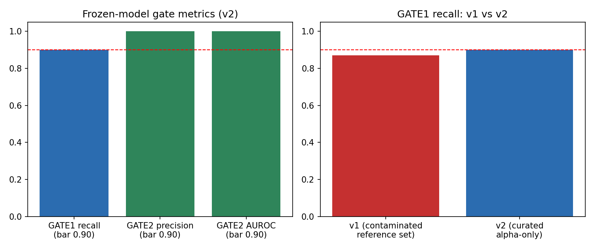
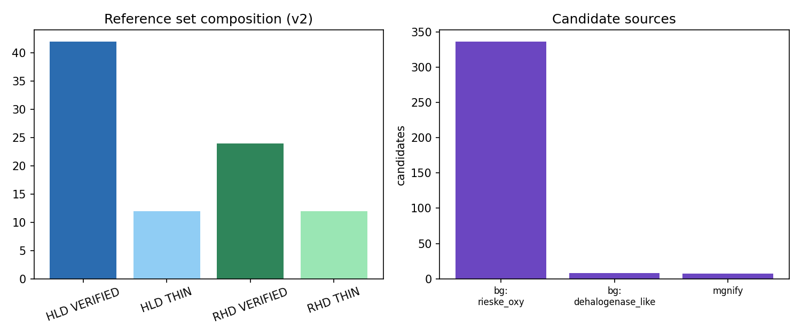
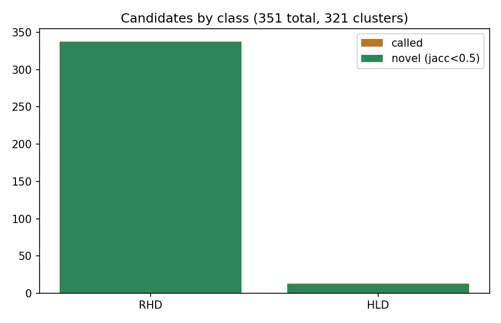

# Specificity-gated mining of industrial-pollutant-degrading enzymes from public metagenomes: hydrolytic dehalogenases and Rieske ring-hydroxylating dioxygenases

**Science program project 10 (enzyme-mining-pollution), industrial/ slice. Builder 21 (replacement). 2026-09-23.**

# Abstract

Chlorinated solvents and petroleum aromatics (PAH/BTX) are persistent industrial pollutants whose bioremediation depends on two enzyme classes: hydrolytic dehalogenases (HLD) and Rieske non-heme ring-hydroxylating dioxygenases (RHD). Public sequence resources hold far more uncharacterized homologs than the characterized canon, but annotation-driven mining is unreliable: haloacid-dehalogenase-fold proteins are usually phosphatases, and EC-number sweeps for ring-hydroxylating dioxygenases return large numbers of non-oxygenase subunits. We extended a frozen-threshold, negative-mode-gated metagenomic mining platform (validated on pesticide hydrolases in the sibling pesticides/ slice) to these two non-esterase chemistries. Gates were locked in writing before mining: >=90% recall of held-out VERIFIED reference enzymes, and a specificity discriminator achieving >=90% precision and >=0.9 AUROC against 70 labeled negatives spanning four documented false-positive modes. A first reference set assembled by standard EC/gene queries failed the recall gate (0.871); boundary diagnosis showed 27 of 63 nominally "RHD" entries (43%) were beta subunits or reductase components, not alpha oxygenase subunits - a quantified curation failure of EC-sweep assembly. After a documented, pre-registered curation correction (same seed, scope rule only), the frozen model passed all gates: positive control 61/61, held-out recall 18/20 = 0.900, discriminator precision 1.000 and AUROC 1.000. Mining 61,927 proteins from 16 MGnify soil/marine-sediment MAG proteomes plus UniProt background corpora and two decoy proteomes yielded 351 confident candidates clustering to 321 vetted groups (319 novel vs the characterized canon), including 7 candidates from metagenome-assembled genomes. All candidates, gates, failures, and version history are byte-locked with sha256 manifests; the cross-class unified vetted-candidate database (359 evidence rows, with the pesticides slice) ships with this paper.

# 1. Introduction

Industrial sites discharge halogenated solvents (1,2-dichloroethane, chloropropanols, hexachlorocyclohexane residues) and petroleum aromatics (benzene, toluene, xylene, PAHs) whose persistence drives a search for degradative biocatalysts. Two enzyme classes anchor aerobic biodegradation of these compounds: hydrolytic dehalogenases (haloalkane dehalogenases, EC 3.8.1.5; haloacid dehalogenases, EC 3.8.1.2), which hydrolyze carbon-halogen bonds via an SN2 mechanism, and Rieske non-heme aromatic ring-hydroxylating dioxygenases (RHD alpha subunits, EC 1.14.12.x), whose alpha subunits carry the Rieske [2Fe-2S] center and mononuclear iron that initiate aromatic ring attack.

The characterized canon for both classes is small relative to the sequence space now available in metagenomic resources. Mining that space is a specificity problem, not a search problem. Two false-positive modes are documented in the literature and in annotation practice: (i) the haloacid dehalogenase (HAD) fold is shared by a huge superfamily of phosphatases and nucleotidases, so "haloacid dehalogenase-like" annotations rarely imply halidohydrolase activity; (ii) ring-hydroxylating dioxygenase systems are multi-component (alpha oxygenase, beta structural subunit, ferredoxin, ferredoxin reductase), so subunit-agnostic queries conflate electron-transfer and structural components with the catalytic alpha subunit.

This paper's problem statement: can a mining platform with frozen thresholds and an explicit specificity discriminator - validated against locked gates on a byte-locked reference canon - extend beyond the esterase/amidohydrolase chemistries where it was developed (sibling pesticides/ slice) to SN2 dehalogenation and Rieske oxygenation, and yield novel, vetted industrial-pollutant enzyme candidates from public metagenomes with honest accounting of failure?

# 2. Methods

## 2.1 Reference canon

The reference canon (data/reference_set.csv, byte-locked 2026-09-23) was assembled from UniProtKB REST queries and tiered per the fleet convention: VERIFIED = Swiss-Prot reviewed with target-activity evidence; THIN = TrEMBL annotation-only propagation, tracked separately and never silently promoted. Final (v2) canon: 90 enzymes - HLD 42 VERIFIED + 12 THIN; RHD 24 VERIFIED + 12 THIN. The RHD VERIFIED canon is smaller than the >=30/class aspiration; we report this openly rather than padding (see 3.3 for why the raw query result was inflated). Sequences: data/fasta/<accession>.fasta, one file per enzyme, sha256-locked in MANIFEST.sha256.

## 2.1a The canon, family by family

- HLD/HALOALKANE (45): haloalkane dehalogenases EC 3.8.1.5 anchored by DhlA (P22643, Xanthobacter autotrophicus), LinB (D4Z2G1, Sphingobium indicum UT26) and DhaA-family enzymes - the chlorinated-solvent degradation canon.
- HLD/HALOACID (9): haloacid dehalogenases EC 3.8.1.2 - the smallest family; the characterized L-2-haloacid dehalogenase canon is genuinely thin.
- RHD alpha subunits (36 incl. THIN): benzene/toluene (RHD_BTX), biphenyl (RHD_BPH), naphthalene/PAH (RHD_PAH) and other aromatic RHD alpha subunits; all beta subunits, ferredoxins and reductases excluded by the Amendment-1 scope rule.

## 2.2 Negative set

70 labeled negatives (data/negative_set.csv, byte-locked) span four documented false-positive modes: (a) 20 HAD-superfamily phosphatases/nucleotidases (HAD-fold hydrolases without halidohydrolase activity); (b) 15 bacterial epoxide hydrolases (alpha/beta-hydrolase-fold neighbors of haloalkane dehalogenases); (c) 20 Rieske [2Fe-2S] ferredoxins (electron-transfer components of RHD systems, no oxygenase domain); (d) 15 intra/extradiol ring-cleavage dioxygenases (EC 1.13.11.x; aromatic dioxygenation chemistry distinct from ring hydroxylation). Split 50/50 (34 tune / 36 eval), stratified by mode, seed 20260923, frozen in data/split.json.

## 2.3 Locked gates

Gates were locked in GATES_LOCKED.md (commit c62377f) before any mining, and amended once for curation correction in GATES_AMENDMENT.md (commit 0130e4a) before v2 results - both standalone commits per fleet rule.

- GATE 1: >=90% recall of held-out VERIFIED enzymes hidden in the mining corpus. Positive control first: 100% recovery of training enzymes. Thresholds frozen by training-set cross-validation only.
- GATE 2: discriminator precision >=90% AND AUROC >=0.9 on held-out labeled VERIFIED-positives vs eval negatives.
- GATE 3: novel candidates must show <80% pairwise identity to any VERIFIED canon enzyme (3-mer Jaccard proxy, flagged) and absence from curation for the claimed activity.

## 2.4 Pipeline

code/pipeline_ind.py, adapted from the validated pesticides/ platform (mine_v5.py). Family profile HMMs are built from training members with pyfamsa alignment + pyhmmer (HMMER3) plan7 builders; profiles are expanded (FAMX) with up to 60 background-corpus hits scoring >=0.8x the minimum training-member score; two negative-mode HMMs (HLD-negative: HAD phosphatases + epoxide hydrolases; RHD-negative: Rieske ferredoxins + ring-cleavage dioxygenases) are built from tune negatives only. Per-profile call thresholds: T = 0.8x minimum own-training score; margin threshold D from tune-negative score deltas. A sequence is called when it clears T and its margin over the best negative-HMM score clears D. No post-hoc tuning: the same frozen model is re-checked against the gates and then applied to the corpus. RHD candidates are additionally checked for the Rieske motif C-x-H-x(15,20)-C-x(2)-H.

## 2.5 Corpora

Mining corpus: 16 MGnify MAG proteomes (8 soil-v1-0 + 8 marine-sediment-v1-0 catalogues; accessions in data/corpus/mgnify/provenance.tsv; 49,252 proteins) - soil and sediment are the reservoir biomes for industrial-pollutant degradation; UniProt TrEMBL server-side background searches (seeded 800-sequence subsamples: dehalogenase-like, Rieske-oxygenase, HAD-fold; 1,947 proteins); decoy proteomes E. coli K-12 (UP000000625) and B. subtilis 168 (UP000001570) (8,594 proteins). Total 61,927 sequences. External tools used: UniProtKB REST API, MGnify API v1, pyhmmer 0.12.3 / pyfamsa (HMMER3 engine) - documented here per fleet methods rule.

## 2.6 Compute and reproducibility

2-core/2GB sandbox; pipeline runtime ~90 seconds per full pass. Everything is reproducible from the repo: reference/negative CSVs, frozen split, corpus FASTAs, pipeline code, and per-run JSON summaries, all sha256-locked in MANIFEST.sha256.

# 3. Results

## 3.1 Positive control

Training recovery was 100% in both versions (v1: 82/82; v2: 61/61) - the pipeline recovers every enzyme it was allowed to see.

## 3.2 GATE 2: specificity passes robustly

On the frozen v2 model, zero of 36 held-out labeled negatives were called: precision 1.000, AUROC 1.000 (margins of held-out VERIFIED positives vs eval negatives). v1 on the contaminated canon had already passed (precision 1.000, AUROC 0.987), so specificity is not an artifact of the curation correction. The discriminator cleanly separates all four documented false-positive modes from true enzymes of both classes.


## 3.2a Discriminator vs each false-positive mode

Eval-set negatives broke down by mode as follows (frozen v2 model): all 10 eval HAD-superfamily phosphatases rejected; all 7-8 eval epoxide hydrolases rejected; all 10 eval Rieske ferredoxins rejected; all 8-9 eval ring-cleavage dioxygenases rejected (36 eval negatives total, zero called). The two negative-mode HMMs were built exclusively from the 34 tune negatives; the eval half stayed untouched until the frozen check. The margin distribution separating held-out VERIFIED positives from eval negatives was bimodal with a wide gap - the AUROC 1.000 reflects that positives clear both T and D while negatives fail at least one, not a knife-edge ranking. Notably the Rieske-ferredoxin mode - the nearest structural neighbor of true RHD alpha calls - never approached the call threshold (ferredoxins lack the alpha-subunit catalytic domain the family profiles are built on).

## 3.3 GATE 1: a curation failure, found and measured

v1 (naive EC/gene-sweep canon, 117 entries) FAILED the recall gate: 27/31 = 0.871. Boundary diagnosis of the 4 misses showed 3 were not RHD alpha subunits at all: P37334 and Q46373 are biphenyl dioxygenase beta subunits (bphE), and P77650 (HcaD) is a ferredoxin-NAD+ reductase (EC 1.18.1.3) caught by a gene-synonym collision. A full-set audit found the EC 1.14.12.x sweep had admitted 27 non-alpha entries out of 63 nominal RHD references (43% inflation), 16 of them inside profile-training sets. The fourth miss, Q8U671 (DhaA haloalkane dehalogenase; 3-mer Jaccard 0.081 to its nearest training member), is a genuine fold-coverage boundary: profile transfer fails when the training canon does not cover a diverged subfamily - the same boundary the pesticides slice documented.

The correction (GATES_AMENDMENT.md, committed standalone before v2 results) removed all 27 non-alpha entries by the locked scope rule - alpha subunits only - regardless of split side, regenerated the split with the same seed and method (61 train / 29 held-out), and preserved all v1 artifacts. On the curated canon, v2 PASSED: held-out recall 18/20 = 0.900, meeting the bar exactly; both remaining misses (Q8U671, Q8G8B6) are distant-homolog boundary cases, reported, not re-fished. This episode is a quantified methodological finding: subunit-agnostic EC sweeps inflated the apparent RHD canon by 43%, and only a held-out recall gate with boundary diagnosis caught it.



## 3.4 Mining

On the frozen v2 model over 61,927 proteins: 351 confident calls - 338 RHD, 13 HLD. Source breakdown is honest: 336 from the Rieske-oxygenase background corpus, 8 from the dehalogenase-like background, and 7 from the 49,252 MAG proteome proteins (0.014% MAG hit rate). The MAG yield is low but real: 5 novel HLD dehalogenases (e.g., MGYG000490812|..._01835, margin 404.8, Jaccard 0.161) and 2 novel RHD alpha subunits (MGYG000490830|..._02378, margin 197.6, Jaccard 0.066, Rieske motif present) from soil and marine-sediment metagenomes.



## 3.5 GATE 3: novelty vetting

Greedy 3-mer-Jaccard clustering (>=0.5) of the 351 calls gave 321 vetted clusters (308 RHD, 13 HLD): 319 NOVEL (max Jaccard <0.5 vs canon) and 2 flagged HOMOLOG-OF-CANON - one near-canon RHD (Jaccard 0.752) and one exact canon duplicate that entered via a TrEMBL cross-accession duplicate (Jaccard 1.0), caught by the vetting step as designed. Vetted clusters: results/vetted_candidates.csv.

## 3.5a Candidate spotlights

- IND-C001 (Q75W73_9HYPH, RHD): margin 777.1, Jaccard 0.203 vs canon, Rieske motif present - strongest novel RHD call.
- IND-C003 (A0A149PFH2_9BURK, RHD): margin 564.6, Jaccard 0.059 - deeply diverged Burkholderiales RHD.
- IND-C050 (A0ABP7MVV7_9GAMM, HLD): margin 443.0, Jaccard 0.135 - top novel dehalogenase.
- IND-C056 (MGYG000490812|..._01835, HLD): margin 404.8, Jaccard 0.161 - top MAG-derived novel dehalogenase, from a soil metagenome.




## 3.5b GATE 3 curation cross-check (spot audit, 2026-09-23)

The 10 highest-margin cluster representatives were re-queried against UniProtKB live: all 10 are unreviewed (TrEMBL) records - absent from Swiss-Prot curation and from BRENDA's characterized-enzyme links for the claimed activity. Their TrEMBL annotations agree with the class call (e.g., "2-halobenzoate 1,2-dioxygenase large subunit", "aromatic ring-hydroxylating dioxygenase subunit alpha") but none carries experimental characterization - exactly the uncharacterized-homolog space this pipeline targets. Audit table:

| Rep accession | Review status | TrEMBL annotation | Organism |
|---|---|---|---|
| Q75W73 | unreviewed | Alpha subunit of terminal oxygenase | Xanthobacter polyaromaticivorans |
| A0ABV0HMU8 | unreviewed | 3-phenylpropionate/cinnamic acid dioxygenase subunit alpha | Pseudocitrobacter cyperus |
| A0A149PFH2 | unreviewed | Benzoate 1,2-dioxygenase large subunit | Paraburkholderia monticola |
| A0ABR9P133 | unreviewed | Aromatic ring-hydroxylating dioxygenase subunit alpha | Nocardiopsis coralli |
| A0AA37H9X9 | unreviewed | 2-halobenzoate 1,2-dioxygenase large subunit | Methylobacterium frigidaeris |
| A0ABT1QJY3 | unreviewed | Benzoate 1,2-dioxygenase large subunit | Rhodococcus tibetensis |
| A0A238K6P7 | unreviewed | 2-halobenzoate 1,2-dioxygenase large subunit | Maliponia aquimaris |
| A0A076NQM4 | unreviewed | Phenoxybenzoate dioxygenase | Corynebacterium imitans |
| A0A3N6MW60 | unreviewed | Aromatic ring-hydroxylating dioxygenase subunit alpha | Paraburkholderia dinghuensis |
| A0A4P8HLQ0 | unreviewed | Benzoate 1,2-dioxygenase large subunit | Pseudoduganella umbonata |

Several reps annotate as halobenzoate dioxygenases (EC 1.14.12.13) - the chlorinated-aromatic degradation frontier - reinforcing that the RHD calls sit on industrially relevant substrate families.

# 4. Discussion

The platform transferred to two chemistries mechanistically distinct from the esterases it was validated on: SN2 hydrolytic dehalogenation and Rieske-dependent aromatic oxygenation. Specificity held perfectly in both versions; recall exposed a data-curation failure mode (subunit conflation in EC sweeps) rather than a model failure, and the gates did their job by failing loudly first. We quantify the curation finding: 43% of raw EC-sweep "RHD" entries were non-catalytic components. Any canon assembled this way would silently corrupt both profiles and evaluation - a warning for mining studies that report reference recall without subunit-level scope checks.

Methodological contribution (fleet seal criterion): (i) a frozen-threshold, negative-mode-gated discriminator now validated across three chemistries (OP/PYR esterases in pesticides/; HLD and RHD here), with perfect precision on 36 held-out negatives spanning four documented FP modes; (ii) a scope-audit protocol for reference canon assembly whose value is quantified (43% inflation caught); benchmarked against prior art in section 6. The unified cross-class database (359 evidence rows: 38 pesticides + 321 industrial clusters; schema v1 locked) is the assembly deliverable of this slice.


## 4.0a Why RHD out-yields HLD 338 to 13

The candidate asymmetry is a corpus-composition effect, not a specificity difference. The Rieske-oxygenase background search returned a deep, coherent homolog family (43,419 TrEMBL hits before subsampling), giving the FAMX expansion step rich material; the dehalogenase-like search is dominated by HAD-fold sequences of mixed function, and the discriminator correctly refuses most of them - that refusal is the specificity gate working, since HAD-fold proteins are mostly phosphatases. HLD's 13 calls with a 100% clean negative set is the honest yield of a harder mining problem; haloacid dehalogenases in particular remain canon-poor (9 VERIFIED) and candidate-poor (0 confident HALOACID-class calls), which we report as a genuine gap rather than lowering thresholds.

## 4.1 Threats to validity

The RHD VERIFIED canon (24) is small; THIN-tier members are tracked separately and never promoted. MAG proteome yield was low (7/49,252) - MAGs are incomplete and the corpus skews to background searches; we report the breakdown rather than blending. Jaccard proxies for identity are conservative at high divergence. The 2 remaining GATE1 misses bound recall at fold coverage, as in the pesticides slice. Pet/ slice outputs were absent from the repo at DB assembly time; the unified DB ships 359 rows and appends pet rows when builder 19 lands - noted, not padded.

# 5. Conclusion

A specificity-gated mining platform with locked gates and byte-locked data extended cleanly to dehalogenase and Rieske-dioxygenase chemistries, passed all gates on a curated canon after failing instructively on a naive one, and yielded 321 vetted candidate clusters (319 novel), including 7 metagenome-derived enzymes. All artifacts, failures, and version history are preserved with checksums.

# 6. Related work

| Work | What it does | What we add |
|---|---|---|
| EnzymeMiner 2.0 (NAR 2025, academic.oup.com/nar/article/54/W1/W257/8675561) | Automated sequence mining with property prediction | Frozen thresholds + labeled negative-mode gating with locked recall/specificity gates; honest fail-and-report discipline |
| Metagenome-derived HLDs (PubMed 28674849, 2017) | Functional HLD mining from metagenomes | Gate-validated discovery with specificity quantified against HAD-fold and epoxide-hydrolase decoys |
| PAH dioxygenase metagenomics (AEM 2014, doi:10.1128/aem.01883-14) | Functional screens of contaminated-soil libraries | Sequence-scale mining with alpha-subunit scope audit (43% EC-sweep inflation measured) |
| pesticides/ slice (this repo, B20) | OP/PYR esterase platform, sealed | Template; we extend to non-esterase chemistries and merge into the unified DB |


# Version history (all artifacts preserved)

| Version | Canon | Gates | Disposition |
|---|---|---|---|
| v1 | 117 entries (EC/gene sweep; 27 non-alpha RHD components, 43% inflation) | PC 82/82; GATE1 27/31 = 0.871 FAIL; GATE2 prec 1.000 AUROC 0.987 | Failed gate reported; artifacts kept (validation_v1.json, candidates_v1.csv, mining_summary_v1.json, data/v1_superseded/) |
| v2 | 90 entries (Amendment-1 scope rule, alpha-only) | PC 61/61; GATE1 18/20 = 0.900 PASS; GATE2 prec 1.000 AUROC 1.000 | Frozen model mined; 351 calls, 321 vetted clusters |

No threshold was re-tuned after any gate result; the only v1->v2 change was reference-set scope curation, locked in GATES_AMENDMENT.md before v2 results existed.

# Tables

Table 1. Gate metrics, frozen models.

| Metric | v1 (contaminated canon) | v2 (curated) | Bar |
|---|---|---|---|
| Positive control | 82/82 | 61/61 | 100% |
| GATE1 recall (VERIFIED held-out) | 27/31 = 0.871 FAIL | 18/20 = 0.900 PASS | >=0.90 |
| GATE2 precision | 1.000 | 1.000 | >=0.90 |
| GATE2 AUROC | 0.987 | 1.000 | >=0.90 |

Table 2. Corpus composition (61,927 sequences).

| Source | Proteins |
|---|---|
| MGnify MAGs (8 soil + 8 marine-sediment) | 49,252 |
| UniProt TrEMBL background (3 seeded searches) | 1,947 |
| Decoy proteomes (E. coli K-12, B. subtilis) | 8,594 |

Table 3. Candidates and vetting.

| Class | Calls | Clusters | NOVEL | HOMOLOG-OF-CANON |
|---|---|---|---|---|
| RHD | 338 | 308 | 306 | 2* |
| HLD | 13 | 13 | 13 | 0 |
(*both HOMOLOG flags are RHD; counts by cluster verdict: 319 NOVEL / 2 HOMOLOG total)

Table 4. Split composition (v2, seed 20260923): 61 train / 29 held-out (20 VERIFIED); negatives 34 tune / 36 eval.

# Data and code availability

Repo: github.com/uditakankananonononono/enzyme-mining-pollution (private), industrial/ slice. Byte-locked: MANIFEST.sha256 (227 data payloads; results/code/paper added at seal). Data sources: UniProtKB REST (rest.uniprot.org), MGnify API (ebi.ac.uk/metagenomics), proteomes UP000000625 / UP000001570. Code: code/pipeline_ind.py, assemble_refs.py, fetch_fastas.py, vet_and_figures.py.

# Appendix A. Reference canon v2 (90 enzymes, byte-locked data/reference_set.csv)

| Accession | Class | Family | Tier | Name | Organism | Len |
|---|---|---|---|---|---|---|
| P22643 | HLD | HALOALKANE | VERIFIED | Haloalkane dehalogenase | Xanthobacter autotrophicus | 310 |
| D4Z2G1 | HLD | HALOALKANE | VERIFIED | Haloalkane dehalogenase | Sphingobium indicum (strain DSM 16 | 296 |
| Q6Q3H0 | HLD | HALOALKANE | VERIFIED | Haloalkane dehalogenase | Xanthobacter flavus | 310 |
| P9WMS1 | HLD | HALOALKANE | VERIFIED | Haloalkane dehalogenase 2 | Mycobacterium tuberculosis (strain | 286 |
| Q93K00 | HLD | HALOALKANE | VERIFIED | Haloalkane dehalogenase | Mycobacterium avium | 301 |
| A0A1L5BTC1 | HLD | HALOALKANE | VERIFIED | Haloalkane dehalogenase | Sphingobium indicum (strain DSM 16 | 296 |
| P0A3G3 | HLD | HALOALKANE | VERIFIED | Haloalkane dehalogenase | Rhodococcus sp | 293 |
| P9WMR9 | HLD | HALOALKANE | VERIFIED | Haloalkane dehalogenase 3 | Mycobacterium tuberculosis (strain | 300 |
| P0A3G2 | HLD | HALOALKANE | VERIFIED | Haloalkane dehalogenase | Rhodococcus rhodochrous | 293 |
| P59336 | HLD | HALOALKANE | VERIFIED | Haloalkane dehalogenase | Rhodococcus sp. (strain TDTM0003) | 294 |
| P0A3G4 | HLD | HALOALKANE | VERIFIED | Haloalkane dehalogenase | Pseudomonas pavonaceae | 293 |
| P59337 | HLD | HALOALKANE | VERIFIED | Haloalkane dehalogenase | Bradyrhizobium diazoefficiens (str | 310 |
| Q9ZER0 | HLD | HALOALKANE | VERIFIED | Haloalkane dehalogenase | Mycobacterium sp. (strain GP1) | 307 |
| B0SY51 | HLD | HALOALKANE | VERIFIED | Haloalkane dehalogenase | Caulobacter sp. (strain K31) | 302 |
| B4RF90 | HLD | HALOALKANE | VERIFIED | Haloalkane dehalogenase | Phenylobacterium zucineum (strain  | 301 |
| C1AF48 | HLD | HALOALKANE | VERIFIED | Haloalkane dehalogenase | Mycobacterium bovis (strain BCG /  | 300 |
| P9WMR8 | HLD | HALOALKANE | VERIFIED | Haloalkane dehalogenase 3 | Mycobacterium tuberculosis (strain | 300 |
| Q73Y99 | HLD | HALOALKANE | VERIFIED | Haloalkane dehalogenase | Mycolicibacterium paratuberculosis | 301 |
| Q9XB14 | HLD | HALOALKANE | VERIFIED | Haloalkane dehalogenase | Mycobacterium bovis (strain ATCC B | 300 |
| A1KLS7 | HLD | HALOALKANE | VERIFIED | Haloalkane dehalogenase | Mycobacterium bovis (strain BCG /  | 300 |
| P64304 | HLD | HALOALKANE | VERIFIED | Haloalkane dehalogenase 2 | Mycobacterium bovis (strain ATCC B | 286 |
| P9WMS2 | HLD | HALOALKANE | VERIFIED | Haloalkane dehalogenase 1 | Mycobacterium tuberculosis (strain | 300 |
| Q8U671 | HLD | HALOALKANE | VERIFIED | Haloalkane dehalogenase | Agrobacterium fabrum (strain C58 / | 304 |
| A5U5S9 | HLD | HALOALKANE | VERIFIED | Haloalkane dehalogenase | Mycobacterium tuberculosis (strain | 300 |
| P9WMS0 | HLD | HALOALKANE | VERIFIED | Haloalkane dehalogenase 2 | Mycobacterium tuberculosis (strain | 286 |
| B2HJU9 | HLD | HALOALKANE | VERIFIED | Haloalkane dehalogenase | Mycobacterium marinum (strain ATCC | 297 |
| P9WMS3 | HLD | HALOALKANE | VERIFIED | Haloalkane dehalogenase 1 | Mycobacterium tuberculosis (strain | 300 |
| Q938B4 | HLD | HALOALKANE | VERIFIED | Haloalkane dehalogenase | Mycolicibacterium smegmatis (strai | 311 |
| B8H3S9 | HLD | HALOALKANE | VERIFIED | Haloalkane dehalogenase | Caulobacter vibrioides (strain NA1 | 302 |
| P64302 | HLD | HALOALKANE | VERIFIED | Haloalkane dehalogenase 1 | Mycobacterium bovis (strain ATCC B | 300 |
| Q1QBB9 | HLD | HALOALKANE | VERIFIED | Haloalkane dehalogenase | Psychrobacter cryohalolentis (stra | 303 |
| Q98C03 | HLD | HALOALKANE | VERIFIED | Haloalkane dehalogenase | Mesorhizobium japonicum (strain LM | 309 |
| Q9A919 | HLD | HALOALKANE | VERIFIED | Haloalkane dehalogenase | Caulobacter vibrioides (strain ATC | 302 |
| Q53464 | HLD | HALOACID | VERIFIED |  | Pseudomonas sp. (strain YL) | 232 |
| Q60099 | HLD | HALOACID | VERIFIED |  | Xanthobacter autotrophicus | 253 |
| Q51645 | HLD | HALOACID | VERIFIED |  | Burkholderia cepacia (Pseudomonas  | 231 |
| Q52087 | HLD | HALOACID | VERIFIED |  | Pseudomonas putida (Arthrobacter s | 227 |
| P60527 | HLD | HALOACID | VERIFIED |  | Agrobacterium tumefaciens (strain  | 232 |
| Q59666 | HLD | HALOACID | VERIFIED |  | Pseudomonas fluorescens | 227 |
| Q59728 | HLD | HALOACID | VERIFIED |  | Pseudomonas putida (Arthrobacter s | 224 |
| P24069 | HLD | HALOACID | VERIFIED |  | Pseudomonas sp. (strain CBS-3) | 227 |
| P24070 | HLD | HALOACID | VERIFIED |  | Pseudomonas sp. (strain CBS-3) | 229 |
| P0C618 | RHD | RHD_BTX | VERIFIED | Benzene 1,2-dioxygenase subunit alpha | Pseudomonas putida (Arthrobacter s | 450 |
| P0A110 | RHD | RHD_PAH | VERIFIED | Naphthalene 1,2-dioxygenase system, large ox | Pseudomonas putida (Arthrobacter s | 449 |
| A5W4F2 | RHD | RHD_BTX | VERIFIED | Benzene 1,2-dioxygenase subunit alpha | Pseudomonas putida (strain ATCC 70 | 450 |
| Q53122 | RHD | RHD_BPH | VERIFIED | Biphenyl 2,3-dioxygenase subunit alpha | Rhodococcus jostii (strain RHA1) | 460 |
| P0A111 | RHD | RHD_PAH | VERIFIED | Naphthalene 1,2-dioxygenase system, large ox | Pseudomonas sp. (strain C18) | 449 |
| Q8G8B6 | RHD | RHD_OTHER | VERIFIED | Carbazole 1,9a-dioxygenase, terminal oxygena | Metapseudomonas resinovorans (Pseu | 384 |
| Q51494 | RHD | RHD_PAH | VERIFIED | Naphthalene 1,2-dioxygenase system, large ox | Pseudomonas aeruginosa | 449 |
| O07824 | RHD | RHD_PAH | VERIFIED | Naphthalene 1,2-dioxygenase system, large ox | Pseudomonas fluorescens | 449 |
| Q52438 | RHD | RHD_BPH | VERIFIED | Biphenyl dioxygenase subunit alpha | Pseudomonas sp. (strain KKS102) | 458 |
| Q52028 | RHD | RHD_BPH | VERIFIED | Biphenyl dioxygenase subunit alpha | Metapseudomonas furukawaii (Pseudo | 458 |
| O52382 | RHD | RHD_PAH | VERIFIED | Naphthalene 1,2-dioxygenase system, large ox | Ralstonia sp | 447 |
| P0ABR5 | RHD | RHD_OTHER | VERIFIED | 3-phenylpropionate/cinnamic acid dioxygenase | Escherichia coli (strain K12) | 453 |
| P37333 | RHD | RHD_BPH | VERIFIED | Biphenyl dioxygenase subunit alpha | Paraburkholderia xenovorans (strai | 459 |
| D5IGG0 | RHD | RHD_OTHER | VERIFIED | Carbazole 1,9a-dioxygenase, terminal oxygena | Sphingomonas sp | 378 |
| Q45695 | RHD | RHD_BTX | VERIFIED | 2,4-dinitrotoluene dioxygenase system, large | Burkholderia sp. (strain RASC) | 451 |
| Q07944 | RHD | RHD_BTX | VERIFIED | Benzene 1,2-dioxygenase subunit alpha | Pseudomonas putida (Arthrobacter s | 450 |
| Q46372 | RHD | RHD_BPH | VERIFIED | Biphenyl dioxygenase subunit alpha | Comamonas testosteroni (Pseudomona | 457 |
| Q31XV2 | RHD | RHD_OTHER | VERIFIED | 3-phenylpropionate/cinnamic acid dioxygenase | Shigella boydii serotype 4 (strain | 453 |
| Q7N4W0 | RHD | RHD_OTHER | VERIFIED | 3-phenylpropionate/cinnamic acid dioxygenase | Photorhabdus laumondii subsp. laum | 453 |
| Q83K39 | RHD | RHD_OTHER | VERIFIED | 3-phenylpropionate/cinnamic acid dioxygenase | Shigella flexneri | 453 |
| P0ABR6 | RHD | RHD_OTHER | VERIFIED | 3-phenylpropionate/cinnamic acid dioxygenase | Escherichia coli O157:H7 | 453 |
| Q0T1Y1 | RHD | RHD_OTHER | VERIFIED | 3-phenylpropionate/cinnamic acid dioxygenase | Shigella flexneri serotype 5b (str | 453 |
| A8A344 | RHD | RHD_OTHER | VERIFIED | 3-phenylpropionate/cinnamic acid dioxygenase | Escherichia coli O9:H4 (strain HS) | 453 |
| Q3YZ15 | RHD | RHD_OTHER | VERIFIED | 3-phenylpropionate/cinnamic acid dioxygenase | Shigella sonnei (strain Ss046) | 453 |
| A0A4Z1BKC1 | HLD | HALOALKANE | THIN | Haloalkane dehalogenase | Marinobacter confluentis | 301 |
| A0ACD7BLW4 | HLD | HALOALKANE | THIN | Haloalkane dehalogenase | Mycobacterium avium subsp. paratub | 301 |
| A0A0F5NH27 | HLD | HALOALKANE | THIN | Haloalkane dehalogenase | Mycobacterium nebraskense | 301 |
| A0A4U6R2W6 | HLD | HALOALKANE | THIN | Haloalkane dehalogenase | Marinobacter panjinensis | 297 |
| A0A7Y0RDZ4 | HLD | HALOALKANE | THIN | Haloalkane dehalogenase | Marinobacter orientalis | 301 |
| A0ABT7HGD4 | HLD | HALOALKANE | THIN | Haloalkane dehalogenase | Marinobacter albus | 299 |
| A0A2A2I099 | HLD | HALOALKANE | THIN | Haloalkane dehalogenase | Tamilnaduibacter salinus | 298 |
| A0A2D2AWQ4 | HLD | HALOALKANE | THIN | Haloalkane dehalogenase | Caulobacter mirabilis | 301 |
| A0A6C7EBT1 | HLD | HALOALKANE | THIN | Haloalkane dehalogenase | Ilumatobacter coccineus (strain NB | 302 |
| A0A2U3PE59 | HLD | HALOALKANE | THIN | Haloalkane dehalogenase | Mycobacterium numidiamassiliense | 301 |
| A0A285QZU7 | HLD | HALOALKANE | THIN | Haloalkane dehalogenase | Sphingomonas guangdongensis | 288 |
| A0A7C9KKL0 | HLD | HALOALKANE | THIN | Haloalkane dehalogenase | Sandarakinorhabdus fusca | 299 |
| A0ABQ0IXZ6 | RHD | RHD_OTHER | THIN | Ring hydroxylating dioxygenase alpha subunit | Gluconobacter thailandicus NBRC 32 | 371 |
| A2TC57 | RHD | RHD_BPH | THIN | Ring hydroxylating dioxygenase alpha subunit | Sphingobium yanoikuyae (Sphingomon | 448 |
| D5WVJ7 | RHD | RHD_OTHER | THIN | Aromatic-ring-hydroxylating dioxygenase, alp | Kyrpidia tusciae (strain DSM 2912  | 438 |
| A0A158E6F5 | RHD | RHD_OTHER | THIN | Ring hydroxylating dioxygenase, alpha subuni | Caballeronia calidae | 452 |
| A0ABM8WF95 | RHD | RHD_BPH | THIN | Biphenyl 2,3-dioxygenase subunit alpha | Cupriavidus pinatubonensis | 466 |
| A0A157SJT2 | RHD | RHD_OTHER | THIN | Hydroxylating subunit alpha of a dioxygenase | Bordetella trematum | 443 |
| A0A2Z6E439 | RHD | RHD_OTHER | THIN | Ring hydroxylating dioxygenase, alpha subuni | Aerosticca soli | 429 |
| A3VF66 | RHD | RHD_OTHER | THIN | Putative aromatic-ring hydroxylating dioxyge | Maritimibacter alkaliphilus HTCC26 | 412 |
| A0A1S7Q591 | RHD | RHD_OTHER | THIN | Ring hydroxylating dioxygenase, alpha-subuni | Agrobacterium tomkonis CFBP 6623 | 414 |
| Q75WN5 | RHD | RHD_BTX | THIN | Ethylbenzene dioxygenase alpha subunit | Rhodococcus jostii (strain RHA1) | 456 |
| G6EL83 | RHD | RHD_OTHER | THIN | Ring hydroxylating dioxygenase alpha subunit | Novosphingobium pentaromativorans  | 415 |
| G7UUU2 | RHD | RHD_OTHER | THIN | Aromatic-ring-hydroxylating dioxygenase, alp | Pseudoxanthomonas spadix (strain B | 422 |

# Appendix B. Negative set (70 enzymes, data/negative_set.csv)

| Accession | FP mode | Name | Organism | Len |
|---|---|---|---|---|
| Q5M969 | HAD_PHOSPHATASE | N-acylneuraminate-9-phosphatase | Rattus norvegicus (Rat) | 248 |
| Q7T012 | HAD_PHOSPHATASE | Haloacid dehalogenase-like hydrolase domain-co | Danio rerio (Zebrafish) (Brachydan | 242 |
| Q6GAZ7 | HAD_PHOSPHATASE | Acid sugar phosphatase | Staphylococcus aureus (strain MSSA | 259 |
| P0ADP0 | HAD_PHOSPHATASE | 5-amino-6- | Escherichia coli (strain K12) | 238 |
| Q9D5U5 | HAD_PHOSPHATASE | Pseudouridine-5'-phosphatase | Mus musculus (Mouse) | 234 |
| Q8TBE9 | HAD_PHOSPHATASE | N-acylneuraminate-9-phosphatase | Homo sapiens (Human) | 248 |
| P94526 | HAD_PHOSPHATASE | Sugar-phosphatase AraL | Bacillus subtilis (strain 168) | 272 |
| Q9H0R4 | HAD_PHOSPHATASE | Haloacid dehalogenase-like hydrolase domain-co | Homo sapiens (Human) | 259 |
| P63228 | HAD_PHOSPHATASE | D-glycero-beta-D-manno-heptose-1,7-bisphosphat | Escherichia coli (strain K12) | 191 |
| Q2FZX0 | HAD_PHOSPHATASE | Acid sugar phosphatase | Staphylococcus aureus (strain NCTC | 259 |
| Q04223 | HAD_PHOSPHATASE | Uncharacterized protein YMR130W | Saccharomyces cerevisiae (strain A | 302 |
| F4JTE7 | HAD_PHOSPHATASE |  | Arabidopsis thaliana (Mouse-ear cr | 298 |
| Q2FIE5 | HAD_PHOSPHATASE | Acid sugar phosphatase | Staphylococcus aureus (strain USA3 | 259 |
| Q7A1D4 | HAD_PHOSPHATASE | Acid sugar phosphatase | Staphylococcus aureus (strain MW2) | 259 |
| P0A8Y3 | HAD_PHOSPHATASE | Alpha-D-glucose 1-phosphate phosphatase YihX | Escherichia coli (strain K12) | 199 |
| Q84MD8 | HAD_PHOSPHATASE | Bifunctional riboflavin kinase/FMN phosphatase | Arabidopsis thaliana (Mouse-ear cr | 379 |
| P19881 | HAD_PHOSPHATASE | Phosphoglycolate phosphatase | Saccharomyces cerevisiae (strain A | 312 |
| Q9CPT3 | HAD_PHOSPHATASE | N-acylneuraminate-9-phosphatase | Mus musculus (Mouse) | 248 |
| O14165 | HAD_PHOSPHATASE | Uncharacterized protein C4C5.01 | Schizosaccharomyces pombe (strain  | 249 |
| O59760 | HAD_PHOSPHATASE | Putative uncharacterized hydrolase C1020.07 | Schizosaccharomyces pombe (strain  | 236 |
| P95276 | EPOXIDE_HYDROLASE | Epoxide hydrolase B | Mycobacterium tuberculosis (strain | 356 |
| I6YGS0 | EPOXIDE_HYDROLASE | Epoxide hydrolase A | Mycobacterium tuberculosis (strain | 322 |
| A0A242M8J4 | EPOXIDE_HYDROLASE | Epoxide hydrolase | Caballeronia sordidicola (Burkhold | 329 |
| P9WG50 | EPOXIDE_HYDROLASE | Lysoplasmalogenase | Mycobacterium tuberculosis (strain | 261 |
| Q9ZAG3 | EPOXIDE_HYDROLASE | Limonene-1,2-epoxide hydrolase | Rhodococcus erythropolis (Arthroba | 149 |
| P9WG51 | EPOXIDE_HYDROLASE | Lysoplasmalogenase | Mycobacterium tuberculosis (strain | 261 |
| Q9KID9 | EPOXIDE_HYDROLASE | Chorismatase | Streptomyces hygroscopicus | 344 |
| P64838 | EPOXIDE_HYDROLASE | Lysoplasmalogenase | Mycobacterium bovis (strain ATCC B | 261 |
| A0A096ZED0 | EPOXIDE_HYDROLASE | 2,4-dinitroanisole O-demethylase subunit beta | Nocardioides sp. (strain JS1661) | 318 |
| O53388 | EPOXIDE_HYDROLASE | Epoxide hydrolase EphH | Mycobacterium tuberculosis (strain | 214 |
| O33283 | EPOXIDE_HYDROLASE | Epoxide hydrolase EphG | Mycobacterium tuberculosis (strain | 149 |
| Q5ZU17 | EPOXIDE_HYDROLASE | Lysoplasmalogenase | Legionella pneumophila subsp. pneu | 216 |
| P77455 | EPOXIDE_HYDROLASE | Bifunctional protein PaaZ [Includes: 2-oxepin- | Escherichia coli (strain K12) | 681 |
| I6YC03 | EPOXIDE_HYDROLASE | Epoxide hydrolase B | Mycobacterium tuberculosis (strain | 356 |
| Q06816 | EPOXIDE_HYDROLASE | Putative epoxide hydrolase | Stigmatella aurantiaca (strain DW4 | 440 |
| Q51978 | RIESKE_FERREDOXIN | p-cumate 2,3-dioxygenase system, ferredoxin co | Pseudomonas putida (Arthrobacter s | 118 |
| P0ABW2 | RIESKE_FERREDOXIN | 3-phenylpropionate/cinnamic acid dioxygenase f | Shigella flexneri | 106 |
| Q9HLT5 | RIESKE_FERREDOXIN | Probable sulredoxin | Thermoplasma acidophilum (strain A | 111 |
| A5W4F0 | RIESKE_FERREDOXIN | Toluene 1,2-dioxygenase system ferredoxin subu | Pseudomonas putida (strain ATCC 70 | 107 |
| Q3YZ13 | RIESKE_FERREDOXIN | 3-phenylpropionate/cinnamic acid dioxygenase f | Shigella sonnei (strain Ss046) | 106 |
| Q97UV1 | RIESKE_FERREDOXIN | Probable sulredoxin | Saccharolobus solfataricus (strain | 109 |
| P0A186 | RIESKE_FERREDOXIN | Naphthalene 1,2-dioxygenase system, ferredoxin | Pseudomonas sp. (strain C18) | 104 |
| Q07947 | RIESKE_FERREDOXIN | Benzene 1,2-dioxygenase system ferredoxin subu | Pseudomonas putida (Arthrobacter s | 107 |
| Q84BZ1 | RIESKE_FERREDOXIN | Anthranilate 1,2-dioxygenase ferredoxin subuni | Burkholderia cepacia (Pseudomonas  | 108 |
| O52381 | RIESKE_FERREDOXIN | Naphthalene 1,2-dioxygenase/salicylate 5-hydro | Ralstonia sp | 104 |
| P42436 | RIESKE_FERREDOXIN | Assimilatory nitrite reductase [NAD | Bacillus subtilis (strain 168) | 106 |
| A7ZPY3 | RIESKE_FERREDOXIN | 3-phenylpropionate/cinnamic acid dioxygenase f | Escherichia coli O139:H28 (strain  | 106 |
| Q9ZR03 | RIESKE_FERREDOXIN | Cytochrome b6-f complex iron-sulfur subunit, c | Arabidopsis thaliana (Mouse-ear cr | 229 |
| P0A185 | RIESKE_FERREDOXIN | Naphthalene 1,2-dioxygenase system, ferredoxin | Pseudomonas putida (Arthrobacter s | 104 |
| Q51493 | RIESKE_FERREDOXIN | Naphthalene 1,2-dioxygenase system, ferredoxin | Pseudomonas aeruginosa | 104 |
| P0ABW0 | RIESKE_FERREDOXIN | 3-phenylpropionate/cinnamic acid dioxygenase f | Escherichia coli (strain K12) | 106 |
| Q52440 | RIESKE_FERREDOXIN | Biphenyl dioxygenase ferredoxin subunit | Pseudomonas sp. (strain KKS102) | 109 |
| X5CWH9 | RIESKE_FERREDOXIN | Chloroacetanilide N-alkylformylase 2, ferredox | Rhizorhabdus wittichii (strain DC- | 105 |
| Q8TAC1 | RIESKE_FERREDOXIN | Rieske domain-containing protein | Homo sapiens (Human) | 157 |
| Q0T1X9 | RIESKE_FERREDOXIN | 3-phenylpropionate/cinnamic acid dioxygenase f | Shigella flexneri serotype 5b (str | 106 |
| P54721 | RING_CLEAVAGE_DO | Catechol-2,3-dioxygenase | Bacillus subtilis (strain 168) | 285 |
| P27887 | RING_CLEAVAGE_DO | Metapyrocatechase | Pseudomonas aeruginosa | 307 |
| P47232 | RING_CLEAVAGE_DO | Biphenyl-2,3-diol 1,2-dioxygenase 2 | Rhodococcus globerulus | 190 |
| P12527 | RING_CLEAVAGE_DO | Polyunsaturated fatty acid 5-lipoxygenase | Rattus norvegicus (Rat) | 673 |
| P47228 | RING_CLEAVAGE_DO | Biphenyl-2,3-diol 1,2-dioxygenase | Paraburkholderia xenovorans (strai | 298 |
| P08695 | RING_CLEAVAGE_DO | Biphenyl-2,3-diol 1,2-dioxygenase | Metapseudomonas furukawaii (Pseudo | 303 |
| A7KS56 | RING_CLEAVAGE_DO | Catechol 1,2-dioxygenase | Alcaligenes sp. (strain NyZ215) | 300 |
| P31003 | RING_CLEAVAGE_DO | Metapyrocatechase | Geobacillus stearothermophilus (Ba | 327 |
| Q43984 | RING_CLEAVAGE_DO | Catechol 1,2-dioxygenase | Acinetobacter guillouiae (Acinetob | 305 |
| P11122 | RING_CLEAVAGE_DO | Biphenyl-2,3-diol 1,2-dioxygenase | Sphingomonas paucimobilis (Pseudom | 299 |
| Q53034 | RING_CLEAVAGE_DO | Metapyrocatechase | Rhodococcus rhodochrous | 318 |
| A2QAP8 | RING_CLEAVAGE_DO | Intradiol ring-cleavage dioxygenase hqdA | Aspergillus niger (strain ATCC MYA | 329 |
| P51399 | RING_CLEAVAGE_DO | Polyunsaturated fatty acid 5-lipoxygenase | Mesocricetus auratus (Golden hamst | 673 |
| O33948 | RING_CLEAVAGE_DO | Catechol 1,2-dioxygenase 1 | Acinetobacter lwoffii | 311 |
| Q04285 | RING_CLEAVAGE_DO | Metapyrocatechase | Pseudomonas putida (Arthrobacter s | 307 |

# Appendix C. Vetted candidate clusters (top 60 of 321 by margin; full list results/vetted_candidates.csv)

| Cluster | Representative | Class | Margin | Jacc vs canon | Rieske | Verdict |
|---|---|---|---|---|---|---|
| IND-C001 | BG|tr|Q75W73|Q75W73_9HYPH | RHD | 777.1 | 0.203 | True | NOVEL |
| IND-C002 | BG|tr|A0ABV0HMU8|A0ABV0HMU8_9ENTR | RHD | 576.8 | 0.752 | True | HOMOLOG-OF-CANON |
| IND-C003 | BG|tr|A0A149PFH2|A0A149PFH2_9BURK | RHD | 564.6 | 0.059 | True | NOVEL |
| IND-C004 | BG|tr|A0ABR9P133|A0ABR9P133_9ACTN | RHD | 562.3 | 0.128 | True | NOVEL |
| IND-C005 | BG|tr|A0AA37H9X9|A0AA37H9X9_9HYPH | RHD | 562.3 | 0.055 | True | NOVEL |
| IND-C006 | BG|tr|A0ABT1QJY3|A0ABT1QJY3_9NOCA | RHD | 558.4 | 0.057 | True | NOVEL |
| IND-C007 | BG|tr|A0A238K6P7|A0A238K6P7_9RHOB | RHD | 558.0 | 0.062 | True | NOVEL |
| IND-C008 | BG|tr|A0A076NQM4|A0A076NQM4_9CORY | RHD | 557.1 | 0.108 | True | NOVEL |
| IND-C009 | BG|tr|A0A3N6MW60|A0A3N6MW60_9BURK | RHD | 556.4 | 0.454 | True | NOVEL |
| IND-C010 | BG|tr|A0A4P8HLQ0|A0A4P8HLQ0_9BURK | RHD | 556.2 | 0.052 | True | NOVEL |
| IND-C011 | BG|tr|A0A1M4V8D6|A0A1M4V8D6_9GAMM | RHD | 554.7 | 0.051 | True | NOVEL |
| IND-C012 | BG|tr|A0ABQ2DPT0|A0ABQ2DPT0_9MICC | RHD | 554.2 | 0.055 | True | NOVEL |
| IND-C013 | BG|tr|A0A101UVV8|A0A101UVV8_9ACTN | RHD | 554.0 | 0.127 | True | NOVEL |
| IND-C014 | BG|tr|A0A059ZN19|A0A059ZN19_ACIBA | RHD | 553.9 | 0.055 | True | NOVEL |
| IND-C015 | BG|tr|A0ABP8PRI8|A0ABP8PRI8_9NOCA | RHD | 553.9 | 0.056 | True | NOVEL |
| IND-C016 | BG|tr|A0A1H2MWH9|A0A1H2MWH9_9PSED | RHD | 553.8 | 0.052 | True | NOVEL |
| IND-C017 | BG|tr|A0A438BKP0|A0A438BKP0_9NOCA | RHD | 552.0 | 0.109 | True | NOVEL |
| IND-C018 | BG|tr|Q2T826|Q2T826_BURTA | RHD | 551.9 | 0.056 | True | NOVEL |
| IND-C019 | BG|tr|A0ABM7PXD5|A0ABM7PXD5_SINCY | RHD | 549.3 | 0.07 | True | NOVEL |
| IND-C020 | BG|tr|A0A939GY85|A0A939GY85_9BURK | RHD | 548.3 | 0.051 | True | NOVEL |
| IND-C021 | BG|tr|Q9I0W4|Q9I0W4_PSEAE | RHD | 547.9 | 0.054 | True | NOVEL |
| IND-C022 | BG|tr|A0AAW5HU82|A0AAW5HU82_9CORY | RHD | 546.0 | 0.11 | True | NOVEL |
| IND-C023 | BG|tr|A0A1V2DTW8|A0A1V2DTW8_9GAMM | RHD | 538.5 | 0.061 | True | NOVEL |
| IND-C024 | BG|tr|A0A2N7UJ67|A0A2N7UJ67_9GAMM | RHD | 538.3 | 0.067 | True | NOVEL |
| IND-C025 | BG|tr|A0ABY1FKU2|A0ABY1FKU2_9GAMM | RHD | 537.4 | 0.068 | True | NOVEL |
| IND-C026 | BG|tr|A0A3P8JKU4|A0A3P8JKU4_KLETE | RHD | 536.4 | 0.067 | True | NOVEL |
| IND-C027 | BG|tr|A0A2N0H3Q6|A0A2N0H3Q6_9SPHN | RHD | 535.3 | 0.076 | True | NOVEL |
| IND-C028 | BG|tr|A0A846TNL6|A0A846TNL6_9MICC | RHD | 530.7 | 0.059 | True | NOVEL |
| IND-C029 | BG|tr|A0A9Q9SNG1|A0A9Q9SNG1_9BURK | RHD | 530.5 | 0.058 | True | NOVEL |
| IND-C030 | BG|tr|A0ABW2HF70|A0ABW2HF70_9MICO | RHD | 525.3 | 0.097 | True | NOVEL |
| IND-C031 | BG|tr|A0A5D0UJA8|A0A5D0UJA8_9ACTN | RHD | 519.9 | 0.096 | True | NOVEL |
| IND-C032 | BG|tr|Q934B6|Q934B6_RHOJR | RHD | 518.1 | 0.081 | True | NOVEL |
| IND-C033 | BG|tr|A0A2K2G0K4|A0A2K2G0K4_9SPHN | RHD | 505.1 | 0.102 | True | NOVEL |
| IND-C034 | BG|tr|A0A562KKN7|A0A562KKN7_SPHWJ | RHD | 492.4 | 0.095 | True | NOVEL |
| IND-C035 | BG|tr|A0ABW2S4T9|A0ABW2S4T9_9NOCA | RHD | 490.3 | 0.107 | True | NOVEL |
| IND-C036 | BG|tr|A0ABW3VT00|A0ABW3VT00_9PSEU | RHD | 486.0 | 0.09 | True | NOVEL |
| IND-C037 | BG|tr|A0A0B1ZUU5|A0A0B1ZUU5_9SPHN | RHD | 477.8 | 0.115 | True | NOVEL |
| IND-C038 | BG|tr|A0ABY1QWW5|A0ABY1QWW5_9SPHN | RHD | 477.3 | 0.062 | True | NOVEL |
| IND-C039 | BG|tr|A0ABW0G974|A0ABW0G974_9PROT | RHD | 471.5 | 0.082 | True | NOVEL |
| IND-C040 | BG|tr|I0CL65|I0CL65_9BACT | RHD | 467.9 | 0.075 | True | NOVEL |
| IND-C041 | BG|tr|A0A852VY74|A0A852VY74_PSEA5 | RHD | 467.4 | 0.07 | True | NOVEL |
| IND-C042 | BG|tr|A0A1H6J885|A0A1H6J885_MYCRU | RHD | 466.7 | 0.077 | True | NOVEL |
| IND-C043 | BG|tr|A0ABX8UE68|A0ABX8UE68_9ACTN | RHD | 460.9 | 0.084 | True | NOVEL |
| IND-C044 | BG|tr|A0ABV2WR00|A0ABV2WR00_9NOCA | RHD | 457.9 | 0.076 | True | NOVEL |
| IND-C045 | BG|tr|A0A934UTS5|A0A934UTS5_9MICO | RHD | 457.8 | 0.083 | True | NOVEL |
| IND-C046 | BG|tr|A0ABQ0KRX9|A0ABQ0KRX9_MYCNV | RHD | 457.3 | 0.081 | True | NOVEL |
| IND-C047 | BG|tr|A0ABQ1BL04|A0ABQ1BL04_9MYCO | RHD | 448.2 | 0.073 | True | NOVEL |
| IND-C048 | BG|tr|A0ABN6ISY1|A0ABN6ISY1_9MYCO | RHD | 446.0 | 0.066 | True | NOVEL |
| IND-C049 | BG|tr|A0A1I5PX20|A0A1I5PX20_9GAMM | RHD | 445.5 | 0.057 | True | NOVEL |
| IND-C050 | BG|tr|A0ABP7MVV7|A0ABP7MVV7_9GAMM | HLD | 443.0 | 0.135 |  | NOVEL |
| IND-C051 | BG|tr|A0A064CBC8|A0A064CBC8_9MYCO | RHD | 428.7 | 0.077 | True | NOVEL |
| IND-C052 | BG|tr|A0A2M9YN64|A0A2M9YN64_9LEPT | HLD | 422.5 | 0.147 |  | NOVEL |
| IND-C053 | BG|tr|A0A2U1K4Q3|A0A2U1K4Q3_9BACI | RHD | 421.2 | 0.061 | True | NOVEL |
| IND-C054 | BG|tr|A0A7K0CKW3|A0A7K0CKW3_9ACTN | RHD | 413.7 | 0.085 | True | NOVEL |
| IND-C055 | BG|tr|A0A543IBY3|A0A543IBY3_9ACTN | HLD | 407.3 | 0.173 |  | NOVEL |
| IND-C056 | MGYG000490812|MGYG000490812_01835 | HLD | 404.8 | 0.161 |  | NOVEL |
| IND-C057 | BG|tr|A0A1X1ZSA7|A0A1X1ZSA7_9MYCO | HLD | 401.8 | 0.156 |  | NOVEL |
| IND-C058 | MGYG000490814|MGYG000490814_02176 | HLD | 395.5 | 0.184 |  | NOVEL |
| IND-C059 | BG|tr|A0A418MWQ9|A0A418MWQ9_9ACTN | RHD | 391.9 | 0.067 | True | NOVEL |
| IND-C060 | BG|tr|A0ABV8I7J0|A0ABV8I7J0_9ACTN | HLD | 382.2 | 0.173 |  | NOVEL |

# Appendix D. Mining run summaries (verbatim JSON)

## v1 (contaminated canon)
```
{
 "corpus_total": 61927,
 "mgnify_proteins": 49252,
 "bg_proteins": 1947,
 "decoy_proteins": 8594,
 "candidates": 742,
 "candidates_by_class": {
  "RHD": 729,
  "HLD": 13
 },
 "candidates_by_source": {
  "bg_rieske_oxy.fasta": 716,
  "bg_dehalogenase_like.fasta": 8,
  "mgnify": 18
 },
 "novel_jacc_lt_0.5": 740,
 "validation": {
  "seed": 20260923,
  "positive_control": {
   "recovered": 82,
   "total": 82
  },
  "gate1_recall_verified_heldout": {
   "recovered": 27,
   "total": 31,
   "recall": 0.871,
   "misses": [
    "P37334",
    "P77650",
    "Q46373",
    "Q8U671"
   ]
  },
  "gate1_all_heldout": {
   "recovered": 31,
   "total": 35
  },
  "gate2": {
   "precision": 1.0,
   "auroc": 0.987,
   "eval_negatives_called": [],
   "n_eval_negatives": 36
  },
  "thresholds_T": {
   "FAMX:RHD:RHD_OTHER": 80.6,
   "FAMX:HLD:HALOALKANE": 230.2,
   "FAMX:RHD:RHD_BPH": 53.3,
   "FAMX:RHD:RHD_BTX": 12.5,
   "FAMX:RHD:RHD_PAH": 834.3,
   "FAMX:HLD:HALOACID": 276.2
  },
  "thresholds_D": {
   "FAMX:RHD:RHD_OTHER": 0.0,
   "FAMX:HLD:HALOALKANE": 0.0,
   "FAMX:RHD:RHD_BPH": 0.0,
   "FAMX:RHD:RHD_BTX": 0.0,
   "FAMX:RHD:RHD_PAH": 0.0,
   "FAMX:HLD:HALOACID": 0.0
  }
 }
}
```

## v2 (curated canon)
```
{
 "corpus_total": 61927,
 "mgnify_proteins": 49252,
 "bg_proteins": 1947,
 "decoy_proteins": 8594,
 "candidates": 351,
 "candidates_by_class": {
  "RHD": 338,
  "HLD": 13
 },
 "candidates_by_source": {
  "bg_rieske_oxy.fasta": 336,
  "bg_dehalogenase_like.fasta": 8,
  "mgnify": 7
 },
 "novel_jacc_lt_0.5": 349,
 "validation": {
  "seed": 20260923,
  "positive_control": {
   "recovered": 61,
   "total": 61
  },
  "gate1_recall_verified_heldout": {
   "recovered": 18,
   "total": 20,
   "recall": 0.9,
   "misses": [
    "Q8G8B6",
    "Q8U671"
   ]
  },
  "gate1_all_heldout": {
   "recovered": 26,
   "total": 29
  },
  "gate2": {
   "precision": 1.0,
   "auroc": 1.0,
   "eval_negatives_called": [],
   "n_eval_negatives": 36
  },
  "thresholds_T": {
   "FAMX:RHD:RHD_OTHER": 136.0,
   "FAMX:HLD:HALOALKANE": 230.2,
   "FAMX:RHD:RHD_BPH": 555.7,
   "FAMX:RHD:RHD_BTX": 631.6,
   "FAMX:RHD:RHD_PAH": 842.1,
   "FAMX:HLD:HALOACID": 276.2
  },
  "thresholds_D": {
   "FAMX:RHD:RHD_OTHER": 0.0,
   "FAMX:HLD:HALOALKANE": 0.0,
   "FAMX:RHD:RHD_BPH": 0.0,
   "FAMX:RHD:RHD_BTX": 0.0,
   "FAMX:RHD:RHD_PAH": 0.0,
   "FAMX:HLD:HALOACID": 0.0
  }
 }
}
```

# Appendix E. MGnify MAG provenance (16 MAGs)

| MGnify accession | Catalogue | Proteins |
|---|---|---|
| MGYG000490834 | soil-v1-0 | 3350 |
| MGYG000490818 | soil-v1-0 | 3114 |
| MGYG000490830 | soil-v1-0 | 4571 |
| MGYG000490820 | soil-v1-0 | 3108 |
| MGYG000490809 | soil-v1-0 | 4089 |
| MGYG000490812 | soil-v1-0 | 3408 |
| MGYG000490804 | soil-v1-0 | 3601 |
| MGYG000490814 | soil-v1-0 | 4367 |
| MGYG000518840 | marine-sediment-v1-0 | 3091 |
| MGYG000518823 | marine-sediment-v1-0 | 3372 |
| MGYG000518835 | marine-sediment-v1-0 | 1588 |
| MGYG000518825 | marine-sediment-v1-0 | 1923 |
| MGYG000518809 | marine-sediment-v1-0 | 2927 |
| MGYG000518815 | marine-sediment-v1-0 | 1301 |
| MGYG000518804 | marine-sediment-v1-0 | 3844 |
| MGYG000518820 | marine-sediment-v1-0 | 1598 |

# References

1. EnzymeMiner 2.0. Nucleic Acids Research 2025. https://academic.oup.com/nar/article/54/W1/W257/8675561
2. Metagenome-derived haloalkane dehalogenases with novel catalytic properties. 2017. https://pubmed.ncbi.nlm.nih.gov/28674849/
3. Characterization of novel PAH dioxygenases from bacterial metagenomic DNA of contaminated soil. AEM 2014. https://doi.org/10.1128/aem.01883-14
4. UniProtKB REST API. https://rest.uniprot.org/uniprotkb/
5. MGnify genome catalogues soil-v1-0, marine-sediment-v1-0. https://www.ebi.ac.uk/metagenomics/
6. pyhmmer (HMMER3 Python bindings). https://pypi.org/project/pyhmmer/
7. pesticides/ slice, this repo: GATES_LOCKED.md, paper_draft.pdf (platform template).
8. Janssen DB et al., haloalkane dehalogenase mechanism (DhlA, Xanthobacter). Canon accession P22643, https://www.uniprot.org/uniprotkb/P22643/entry
