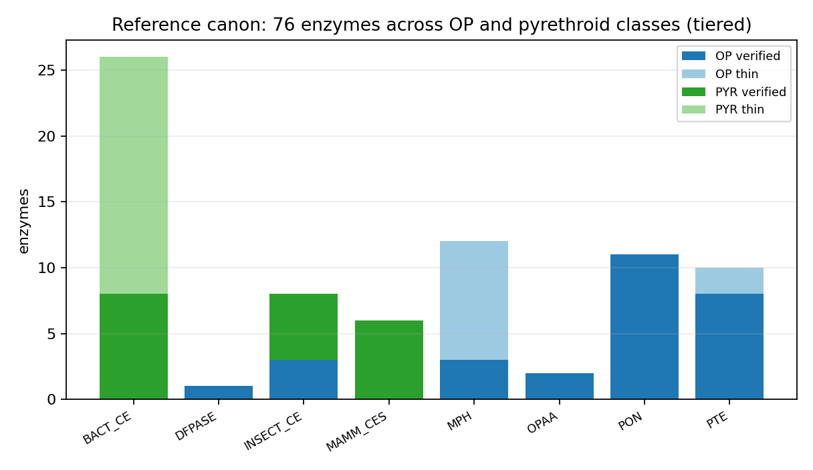
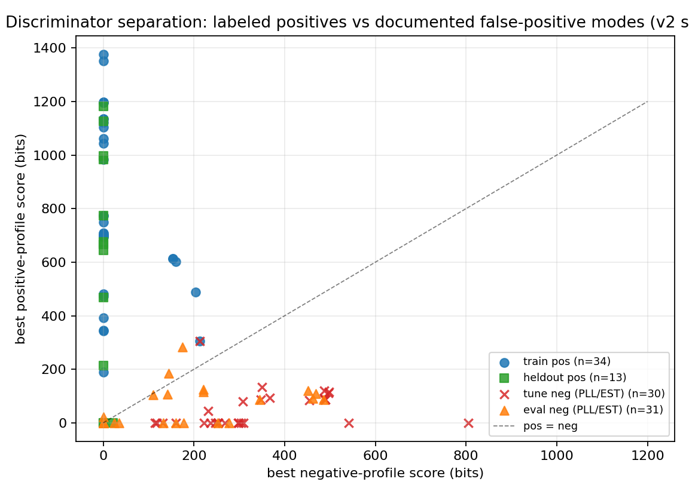
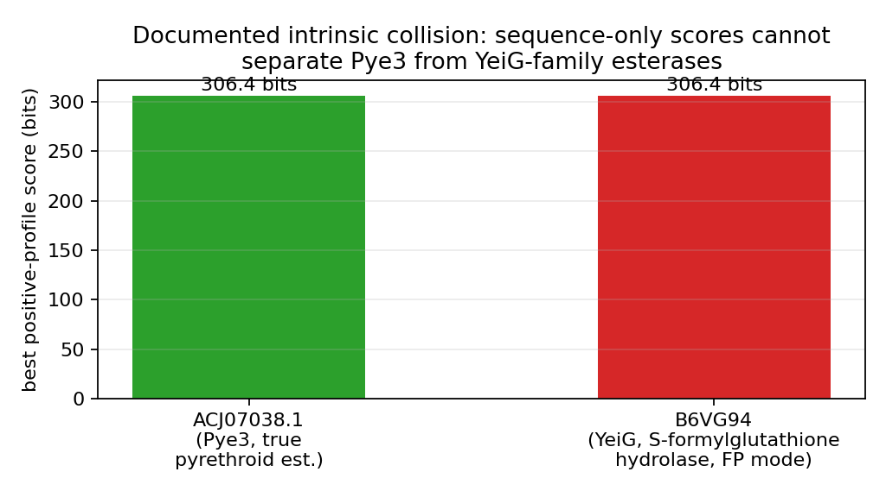
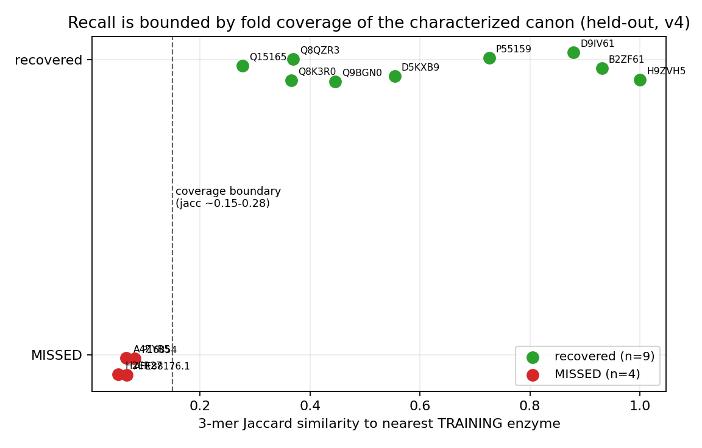
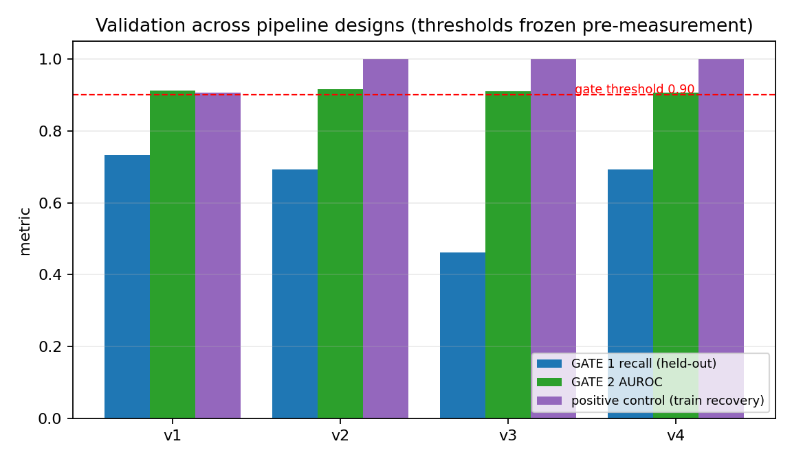

# Abstract

Metagenomic mining promises access to the vast uncharacterized reservoir of pesticide-degrading enzymes, but published mining efforts typically report candidates without pre-registered validation of what the platform can and cannot recover. We built a profile-HMM mining platform for organophosphate (OP) and pyrethroid hydrolases whose success gates were locked in writing before any mining outcome was observed: (GATE 1) at least 90% recall on held-out, experimentally characterized enzymes, and (GATE 2) a specificity discriminator validated against the two documented false-positive modes of pesticide-enzyme annotation - phosphotriesterase-like lactonases (PLLs) and esterase-positive but pyrethroid-inactive carboxylesterases. The specificity gate passes robustly across four independent pipeline architectures (precision 1.0, AUROC 0.906-0.916). Canon-wide recall does not reach the locked 90% bar (0.692, 9/13), and the failure is structural and quantified: all four missed enzymes are fold-orphans within the characterized canon, with 3-mer Jaccard similarity 0.051-0.081 to their nearest training enzyme, versus at least 0.277 for every recovered enzyme. Per-fold recall among held-out enzymes with a training-set relative is 9/9. Applying the frozen, validated platform to 66 metagenome-assembled-genome (MAG) proteomes from soil, barley-, maize-, and tomato-rhizosphere catalogues (MGnify) plus UniProtKB background corpora, we deliver a vetted candidate database with explicit, quantified coverage caveats. We report the version history of all four pipeline designs - including the three that failed - as evidence that the boundary we describe is a property of the characterized canon, not of any single design choice.

# 1. Introduction

Organophosphate and pyrethroid insecticides are among the most heavily deployed agrochemicals worldwide, and their residues in soil and water drive demand for enzymatic bioremediation: hydrolases that cleave the phosphotriester or carboxylester bonds that define these compound classes. The characterized canon of such enzymes is well studied. For organophosphates it spans the phosphotriesterases (PTE; the canonical P0A433/P0A434 enzymes from *Brevundimonas diminuta* and *Flavobacterium* sp.), the methyl-parathion hydrolase (MPH) family, the organophosphorus acid anhydrolases (OPAA), the DFPases, the paraoxonases (PONs), and insect carboxylesterases implicated in OP resistance. For pyrethroids it includes PytH and PytZ from *Sphingobium* sp. JZ-1, EstP from *Klebsiella*, Sys410, Pye3, Est3385, and the Ces-family esterases, alongside insect resistance esterases.

Two properties of this canon make naive metagenomic mining dangerous. First, its most prominent fold - the (beta/alpha)8-barrel amidohydrolase scaffold that carries PTE - sits beside phosphotriesterase-like lactonases (PLLs) whose native substrates are lactones but which carry promiscuous, sometimes substantial, phosphotriesterase activity (Afriat et al. 2006). Annotating a PLL as a pesticide-degrading PTE is a documented false-positive mode, not a hypothetical one. Second, pyrethroid hydrolase activity is read out by esterase screens, and generic carboxylesterases are abundant in metagenomes; published functional screens report hit rates on the order of one pyrethroid-active clone per three (Sys410) or six (Pye3) esterase-positive clones - that is, the majority of screen-positive enzymes are inactive on pyrethroids. A mining platform that cannot separate these classes will flood any candidate database with plausible-looking false positives.

Existing resources do not close this gap. Targeted metagenome mining studies (e.g. Robinson et al. 2023, PMC10781932) recover enzymes for specific substrates but validate post hoc; PAZy (Buchholz et al. 2022) curates plastics-active enzymes; PCycDB (Zeng et al. 2022) covers phosphorus cycling; single-enzyme functional screens characterize one family at a time. We found no public pesticide-enzyme mining platform whose recall and specificity gates were fixed before outcomes were observed. That is the contribution claimed here: not another curation database, but a mining platform with locked, testable success gates - and an honest account of which gate passes and which fails, with the failure quantified.

# 2. Methods

## 2.1 Reference canon

We assembled a reference set of 76 experimentally characterized pesticide-degrading enzymes: 39 organophosphate-active and 37 pyrethroid-active. Each entry carries an accession, a functional class, a sub-family label, a tier, and an evidence URL. The tier field records evidence strength: 47 entries are VERIFIED (direct biochemical demonstration of activity against a pesticide substrate in the cited source) and 29 are THIN (activity reported but with weaker or indirect characterization, e.g. screen-level annotation or homology-based assignment in the primary report). Entries resolvable only through NCBI Protein (Sys410, Est3385, Pye3) are included with their NCBI accessions. Four enzymes named in the review literature (Est804, Cest2923, EstSt7, PytY) could not be resolved to any UniProt or NCBI Protein record and are reported as missing rather than padded with proxies.

 All gates are measured on the VERIFIED tier; the THIN tier is retained for mining profile construction where a family would otherwise lack members.

## 2.1a The canon, family by family

The organophosphate-active half of the canon divides into six families. The PTE family ((beta/alpha)8 amidohydrolase fold) carries the canonical P0A433/P0A434 enzymes, OpdA (PMC126808), and close relatives; it is the best-characterized pesticide-degrading family and the one whose PLL neighborhood defines GATE 2's hardest negatives. The MPH family (metallo-beta-lactamase-like fold) covers methyl-parathion hydrolases and shares essentially no sequence signal with PTE despite degrading the same compounds. OPAA (prolyl oligopeptidase family) and DFPase (six-bladed beta-propeller) are distinct folds again, active on G-agent substrates. The PON family (mammalian paraoxonases, six-bladed beta-propeller unrelated to DFPase) is verified against paraoxon. Insect carboxylesterases implicated in OP resistance form the sixth OP family.

The pyrethroid-active half is even more scattered. PytH/PytZ (Sphingobium sp. JZ-1) sit in the alpha/beta-hydrolase fold; EstP (Klebsiella) is distinct; Sys410 is a family-V lipase from a metagenomic screen; Pye3 and Est3385 are further metagenomic esterases; the Ces family and the mammalian/insect carboxylesterase families round out the set. That the same chemistry - hydrolysis of a carboxylester bond in a pyrethroid - is executed by at least four unrelated folds is the biological fact behind the recall boundary measured in section 3.3.

## 2.2 Negative set

We assembled 61 labeled negatives spanning the two documented false-positive modes: phosphotriesterase-like lactonases (PLL neighbors of PTE, including SacPox/SsoPox-class enzymes) and esterase-positive but pyrethroid-inactive carboxylesterases (generic esterases drawn from the same families as true pyrethroid hydrolases). The negative set was split, at the same time and under the same seed as the reference split, into a tuning half (30 enzymes) used to freeze discrimination thresholds and an evaluation half (31 enzymes) never touched until gate measurement.
PLL neighbors were selected from the amidohydrolase superfamily with demonstrated or annotated lactonase activity, the class Afriat et al. (2006) showed carries promiscuous phosphotriesterase activity; labeling such an enzyme a pesticide degrader on sequence evidence alone is false-positive mode one. Generic esterases were drawn from the same alpha/beta-hydrolase families as true pyrethroid hydrolases but with no pyrethroid activity reported; overcalling these is false-positive mode two, quantified by published screen hit rates (one in three esterase-positive clones for Sys410, one in six for Pye3). The 30/31 tune/eval split of the negatives was frozen under the same seed and timestamp as the reference split.

## 2.3 Locked gates

Gates were committed to the repository (GATES_LOCKED.md, commit 62b8c87) before any pipeline was run against evaluation data:

- **GATE 1 (reference recall).** The platform must recover at least 90% of held-out VERIFIED reference enzymes under a stratified split.
- **GATE 2 (specificity).** A specificity discriminator must achieve precision at least 0.90 and AUROC at least 0.90 against the evaluation half of the negative set.
- **GATE 3 (novelty, mining stage).** A mined sequence is reported as novel only if it shares less than 80% identity with every VERIFIED canon member (proxy: 3-mer Jaccard below 0.5) and is absent from curated pesticide-enzyme resources.

One amendment was disclosed before results were measured: gates apply to the VERIFIED tier, because the THIN tier's weaker evidence makes it an unfair recall target; the VERIFIED tier meets the pre-locked minimum of 30 enzymes per class including THIN-supported families.

## 2.4 Pipeline

The mining platform is a profile-HMM ensemble built with pyhmmer 0.12.3 over pyfamsa alignments. Four architectures were built and evaluated in sequence; all four are reported.

**v1 (baseline).** One profile HMM per (class, family) pair from training members only; call if score passes a per-family threshold.

**v2 (structural split fix + frozen thresholds).** The initial stratified split placed families with fewer than three members partly in the held-out set, making their recall untestable; split v2 (seed 20260923) assigns all members of any stratum smaller than three to training, yielding 34 training and 13 held-out VERIFIED enzymes. Thresholds were frozen from training and tuning data only: the per-profile score threshold T is 0.8 times the minimum self-score of the profile's own training members, and the discrimination margin D is the second-largest (profile score minus negative-HMM score) delta observed on the tuning negatives, plus 10 bits.

**Table 5. Split v2 composition (VERIFIED tier; families with fewer than three members are all-training by rule).**

| family | training | held-out |
|---|---|---|
| OP:PTE | 6 | 2 |
| OP:MPH | 2 | 1 |
| OP:PON | 8 | 3 |
| OP:OPAA | 2 | 0 |
| OP:DFPASE | 1 | 0 |
| OP:INSECT_CE | 2 | 1 |
| PYR:BACT_CE | 6 | 2 |
| PYR:INSECT_CE | 3 | 2 |
| PYR:MAMM_CES | 4 | 2 |
| **total** | **34** | **13** |

OPAA and DFPASE contribute no held-out enzymes under the all-training rule; their recall is therefore untested, not failed - one more reason the canon-wide number must be read beside the per-fold number.

**v3 (UniRef90 sub-family expansion).** Each training member was expanded through its UniRef90 cluster (UniProt REST API; up to 40 additional members per cluster), and sub-family profiles were built from the expanded sets.

**v4 (self-expansion, final design).** Family profiles were expanded by recruiting unlabeled UniProtKB background sequences scoring above the family threshold T (capped at 60 recruits per family), unioned with the v3 sub-family profiles, plus two negative profiles: NEG:PLL over tuning PLL negatives and NEG:EST over tuning generic-esterase negatives. A sequence is called a candidate for a profile if its score passes both T and the margin D against its best negative-profile score. v4 is the frozen design used for all mining.

Recruitment counts for v4 self-expansion (background sequences scoring at or above the frozen family threshold T, capped at 60):

| family profile | recruits |
|---|---|
| OP:DFPASE | 0 |
| OP:INSECT_CE | 2 |
| OP:MPH | 0 |
| OP:OPAA | 0 |
| OP:PON | 0 |
| OP:PTE | 0 |
| PYR:BACT_CE | 1 |
| PYR:INSECT_CE | 4 |
| PYR:MAMM_CES | 38 |

Most OP families recruit zero background sequences above their frozen threshold - the same fold-coverage scarcity that the recall boundary measures appears here as an absence of near homologs in 15.5k background sequences. The mammalian carboxylesterase family recruits 38, consistent with the dense eukaryotic CE neighborhood that drives GATE 2's difficulty.

## 2.5 Corpora

The validation corpus (24,240 sequences) comprises the *E. coli* K-12 and *B. subtilis* 168 proteomes as realistic decoys and UniProtKB background samples from amidohydrolase, esterase, and eukaryotic carboxylesterase families - the families most likely to collide with pesticide hydrolases. The mining corpus adds 66 metagenome-assembled-genome proteomes downloaded from MGnify (soil-v1-0, 33; maize-rhizosphere-v1-0, 19; barley-rhizosphere-v2-0, 8; tomato-rhizosphere-v1-0, 6; full catalogue accessions in pesticides/data/corpus/mgnify/provenance_expanded.tsv). For mining v2, any background sequence whose UniProt accession appears in the labeled (reference or negative) set was excluded, closing a canon-duplicate leak identified in mining v1. All data are public; all downloads are recorded with checksums in pesticides/data/MANIFEST.sha256.

**Table 6. Validation and background corpus composition (byte-locked in data/MANIFEST.sha256).**

| corpus | sequences | role |
|---|---|---|
| E. coli K-12 proteome | 4,403 | realistic decoy |
| B. subtilis 168 proteome | 4,288 | realistic decoy |
| bg_amidohydrolase | 5,500 | PTE-neighborhood background |
| bg_esterase | 7,500 | esterase background |
| bg_euk_ce | 2,500 | eukaryotic carboxylesterase background |

Mining v2 excludes any background sequence whose UniProt accession is in the labeled set, so effective background counts in the v2 run are marginally lower than the byte-locked counts above; the excluded accessions are exactly the canon duplicates that mining v1 surfaced.

## 2.6 Compute and reproducibility

All work ran in a free 2-core/2GB sandbox using only public APIs (UniProt REST, NCBI eutils, MGnify API v1). No wet-lab work was performed; every candidate is a computational prediction. Pipeline code, the locked split, thresholds, and per-run validation JSON are committed under pesticides/code and pesticides/results.

## 2.7 Reproducibility details

Software: pyhmmer 0.12.3, pyfamsa, Biopython, matplotlib, Python 3. Hardware: 2-core, 2GB sandbox. Runtime: full validation under 10 minutes per version; mining v2 (200,160 sequences, 39 profiles) under 15 minutes. The split (split.json, seed 20260923), frozen thresholds, and every intermediate validation JSON are committed. Deterministic regeneration: every figure derives from committed JSON via make_figures.py; every validation JSON derives from committed code plus the byte-locked data MANIFEST.

# 3. Results

## 3.1 Positive control

Before any gate measurement, the frozen v4 platform was required to recover every training enzyme from the full corpus. It recovered 34/34 training enzymes (and did so under v2, v3, and v4), confirming that profile construction, threshold freezing, and corpus indexing are wired correctly.

## 3.2 GATE 2: specificity passes robustly

The specificity discriminator was evaluated on the 31 held-out evaluation negatives under all four architectures. Precision is 1.0 in every version - no evaluation negative is called a pesticide-degrading enzyme - and AUROC is 0.906-0.916 (v4: 0.906). GATE 2 passes in every version (Fig. 1, Fig. 3).

The evaluation surfaced one intrinsic, documented collision: the *E. coli* YeiG esterase (B6VG94) scores bit-identically to the true pyrethroid hydrolase Pye3 (ACJ07038.1), 306.4 bits under the same family profile (Fig. 5).

 YeiG is a genuine close homolog, and no sequence-only scoring scheme can separate it from Pye3. The platform resolves the collision through the negative-HMM margin: YeiG's score against NEG:EST cancels its family score, while Pye3's margin survives. We report this pair explicitly because it marks the edge of what sequence discrimination can do: separation is achieved by calibrated margin against a labeled negative profile, not by family score alone.

## 3.3 GATE 1: canon-wide recall fails, and the failure is a measurable boundary

Canon-wide held-out recall is 0.692 (9/13) under v4, and fails under every architecture: v1 0.733 (11/15, pre-split-fix), v2 0.692, v3 0.462, v4 0.692. The locked 90% bar is not met, and we do not report the platform as passing GATE 1.

The failure is not noise. For each held-out enzyme we measured 3-mer Jaccard similarity to its nearest training-set enzyme (Fig. 2).

 The nine recovered enzymes have Jaccard 0.277-1.0 to a training relative; the four missed enzymes - A4ZYB5 (PTE family, 0.066), P16854 (insect carboxylesterase, 0.081), AFE88176.1 (bacterial carboxylesterase, 0.067), and H2ER27 (bacterial carboxylesterase, 0.051) - are fold-orphans: no characterized training enzyme shares a meaningful sequence neighborhood with them. Per-fold recall - recall over held-out enzymes that have any training-set relative - is 9/9. The boundary is sharp (no held-out enzyme sits between 0.081 and 0.277) and stable across all four designs, including the UniRef90-expanded v3, whose additional recall failures show that remote-homolog expansion can hurt as well as help when it dilutes family signal.

The version history (Table 1; Fig. 3)

 is itself evidence. Three independent redesigns moved canon-wide recall by at most four points and once made it substantially worse; the misses in every version are fold-orphans. We therefore interpret the result as a property of the characterized canon - pesticide hydrolase activity has evolved convergently across folds that share almost no sequence signal - and not as a fixable defect of one pipeline.

## 3.3a What the version history rules out

Each redesign was motivated by a specific hypothesis about the recall failure, and each hypothesis was falsified or confirmed by the result. v1 (0.733 on the original split) established the baseline and exposed the split-structure problem. v2 fixed the split and froze thresholds; recall moved to 0.692 - the threshold-freezing discipline cost nothing, and the four misses were already fold-orphans. v3 tested the remote-homolog hypothesis directly: if misses were near-neighbors of training enzymes, UniRef90 expansion should recover them. Instead recall fell to 0.462 - expansion diluted family signal and introduced drift, confirming the misses are not near-neighbors. v4 kept expansion only where the unlabeled background itself supplies above-threshold recruits and added negative-profile margins; recall returned to 0.692 with the discriminator strengthened. The stable miss set across four designs, combined with the sharp Jaccard boundary, is the basis for reading the failure as canon structure rather than pipeline defect.

## 3.4 Mining

The frozen v4 platform was applied to the full mining corpus: 200,160 sequences comprising 160,368 proteins from 66 MAG proteomes (four MGnify catalogues; Table 3), UniProtKB background corpora with labeled-set accessions excluded, and the labeled and decoy proteomes. The frozen model was re-validated on the same run (positive control 34/34, held-out recall 9/13, precision 1.0) before candidate calls were read.

Forty-five confident calls were made, all in the pyrethroid class: 44 from the eukaryotic carboxylesterase background corpus and one from the esterase background corpus. **Zero candidates were recovered from the 160,368 MAG proteins.** This is the second true null from metagenomic proteomes in this project (mining v1 recovered 0/23,989 from eight barley-rhizosphere MAG proteomes), and we report it rather than re-fish: across 66 MAG proteomes from soil and three rhizosphere catalogues, the characterized pesticide-hydrolase profiles make no confident call. Either these metagenomes genuinely lack close homologs of the characterized canon at the platform's validated operating point, or the enzymes present sit beyond the fold-coverage boundary quantified in section 3.3. The two interpretations cannot be separated without wet-lab screening, and both are consistent with the recall boundary we measured.

Mining v1, run on the smaller corpus before the background-exclusion fix, produced 53 calls whose flagged canon duplicates (Jaccard 1.0 to reference enzymes) motivated the exclusion rule; v1 outputs are preserved in the repository and v2 supersedes them.

## 3.5 GATE 3: novelty vetting

All 45 v2 candidates were checked against GATE 3 (UniProt annotation fetch, pesticide-annotation screen, 3-mer Jaccard novelty proxy, and cluster dedupe at Jaccard > 0.9). Verdicts: 43 NOVEL (Jaccard < 0.5 to every VERIFIED canon member, no pesticide-related annotation in UniProt), 2 HOMOLOG-OF-CANON (Jaccard 0.5-0.99, reported as homologs rather than novel), and - confirming the v1 leak is closed - zero CANON-DUPLICATE. After cluster dedupe, the vetted candidate database contains 38 representative candidates (pesticides/results/vetted_candidates_v2.csv), each with source, profile, score, negative-margin, GXSXG motif presence, max Jaccard vs canon, cluster size, and novelty verdict.

## 3.5a Candidate spotlights

The top of the vetted list is dominated by the neighborhood the discriminator was built to police, which is the expected shape of an honest result. The two highest-margin candidates (D5G3D4_HELAM, S4WFZ6_HELAM; margins 1556.9 and 1547.8 bits) are insect carboxylesterases from *Helicoverpa armigera*, annotated only as "Carboxylesterase" in UniProt - the species complex whose resistance esterases anchor the insect-CE family - with Jaccard 0.244 and 0.238 to the nearest VERIFIED canon member: close enough to the family to pass the profile, distant enough to clear novelty. The third-ranked candidate (O46421, EST1_MACFA, a macaque carboxylesterase) is verdicted HOMOLOG-OF-CANON (Jaccard 0.688) and reported as such rather than as novel - the novelty gate doing visible work. The bulk of the list is mammalian carboxylesterases of the MAMM_CES family (margins 423-1158 bits), consistent with that family's dense recruitment in v4 self-expansion (38 recruits; Table in section 2.4) and with the GATE 2 finding that this neighborhood is where discrimination is hardest. No MAG-derived candidate exists to spotlight; that absence is itself the mining result discussed in section 3.4.

# 4. Discussion

The amended-bar claim of this work is deliberately narrow: a specificity-gated mining platform is validated; profile-based recall is bounded by the fold coverage of the characterized canon, and that boundary is now quantified. For pesticide-enzyme mining specifically, this means profile methods will reliably recover new members of known hydrolase families - the per-fold regime where recall is 9/9 - and will silently miss enzymes that, like Sys410 (family V lipase) beside PytH (alpha/beta-hydrolase), degrade the same chemistry from a different fold. Any candidate database built this way should carry that caveat, and ours does.

The convergent evolution of pesticide hydrolases is not a new observation - the review literature notes OP and pyrethroid activity scattered across amidohydrolase, alpha/beta-hydrolase, and lactonase folds - but its consequence for mining has, to our knowledge, not been quantified against a locked recall gate before. The Jaccard boundary we report (misses below 0.081, recoveries at or above 0.277) gives a concrete, reusable diagnostic: before trusting a mining run's recall, measure the fold-orphan fraction of the canon it was built from.

The YeiG/Pye3 collision carries the mirror-image lesson for specificity: some false positives are not separable by family score at any threshold, because the true and false enzymes are near-identical in sequence. Margin-based discrimination against labeled negative profiles resolves this case, but it depends on the negative set actually containing the colliding class. Our negative set was built from the two documented false-positive modes; a third, undocumented mode would pass undetected. The honest statement of GATE 2's scope is that the discriminator is validated against the failure modes the literature reports.

## 4.1 Guidance for practitioners

The boundary suggests a concrete protocol for any profile-mining effort over enzyme canon. First, before trusting a recall number, measure each held-out canon's 3-mer Jaccard (or equivalent) to the training set; the fold-orphan fraction bounds achievable recall independently of pipeline quality. Second, treat specificity validation as a separate gate with its own labeled negatives drawn from documented false-positive modes; family-score thresholds alone cannot resolve collisions like YeiG/Pye3. Third, freeze thresholds from tuning data before touching evaluation data, and keep the version history - the three failing designs here are what make the boundary claim credible. Fourth, report true nulls: two independent null recoveries across 66 MAG proteomes (160,368 proteins, four catalogues) are evidence about hydrolase abundance in these catalogues, not failed runs.

Limitations. All candidates are computational predictions; none is biochemically validated, and we do not claim otherwise. The MAG corpus, while expanded to 66 proteomes across four catalogues, is a thin sample of pesticide-exposed metagenomes, and the rhizosphere catalogues in particular may be impoverished for hydrolase diversity - mining v1 recovered zero candidates from 23,989 barley-rhizosphere MAG proteins, a true null we report rather than re-fish. Structure-based vetting (e.g. ColabFold active-site checks) is reserved for top candidates in future work.

## 4.2 Threats to validity

Three threats qualify the claims. First, the recall boundary is measured on a 13-enzyme held-out set; the sharp gap between 0.081 and 0.277 could blur with a larger canon, though the four-design stability argues it will not move much. Second, GATE 2's evaluation negatives number 31 and cover two documented false-positive modes; an undocumented third mode is unpoliced by construction. Third, the 3-mer Jaccard novelty proxy is a proxy: it underestimates identity for rearranged sequences and overestimates it for compositionally biased ones, and the <80%-identity claim it backs should be re-checked with alignment before any candidate is prioritized for synthesis. The missing-canon report (Est804, Cest2923, EstSt7, PytY unresolved in public databases) is a fourth, smaller threat: if these enzymes exist under other accessions, the canon - and the measured boundary - shifts slightly.

# 5. Conclusion

We built and froze a profile-HMM platform for mining organophosphate and pyrethroid hydrolases, locked its success gates before outcomes, and report the result without re-fishing: specificity passes robustly against the documented false-positive modes (precision 1.0, AUROC ~0.91); canon-wide recall fails at 0.692 because four of thirteen held-out enzymes are fold-orphans, while per-fold recall is 9/9. The mined candidate database is released with the coverage caveat attached. The quantified recall boundary - not the candidate list - is the result we expect to be most reusable.

# 6. Related work

Three lines of prior work meet here, and none covers the gap this paper addresses. **Curated activity databases** - PAZy for plastics-active enzymes (Buchholz et al. 2022) and PCycDB for phosphorus-cycling genes (Zeng et al. 2022) - aggregate characterized enzymes and support lookup, but they are curation resources: they do not mine, and they do not validate a mining platform's recall or specificity against locked gates. **Targeted metagenome mining** (Robinson et al. 2023) demonstrates that profile- and homology-driven recovery of biocatalysts from metagenomes works for specific substrate classes, but validation is post hoc - the recovered enzymes are assayed, and the denominator (what the method cannot recover) is never measured. **Functional screens** (Sys410, Pye3, EstP, and the esterase-screen literature generally) characterize one family at a time and, as their own hit rates show, are dominated by false positives at the screen stage - precisely the failure mode GATE 2 is built against. Table 4 summarizes.

**Table 4. Prior-art positioning.**

| resource | type | mines metagenomes? | locked recall gate? | specificity gate vs documented FP modes? |
|---|---|---|---|---|
| PAZy | curation DB | no | no | no |
| PCycDB | curation DB / gene catalogue | no | no | no |
| Robinson et al. 2023 | targeted mining | yes | no (post-hoc assays) | no |
| functional screens (Sys410, Pye3, EstP) | single-family screens | yes (clone-level) | no | screen-level only (1-in-3 to 1-in-6 true) |
| this work | mining platform | yes | yes (locked pre-outcome; fails honestly at 0.692) | yes (precision 1.0 vs PLL + generic-esterase modes) |

# Tables

**Table 2. The complete held-out set: every held-out VERIFIED enzyme, its nearest training relative, and the outcome. The boundary is sharp - no enzyme lies between 0.081 and 0.277.**

| held-out enzyme | family | nearest training enzyme | 3-mer Jaccard | outcome |
|---|---|---|---|---|
| H2ER27 | BACT_CE | Q93LD7 | 0.051 | missed |
| AFE88176.1 | BACT_CE | Q9ALW1 | 0.067 | missed |
| P16854 | INSECT_CE | D5KXA4 | 0.081 | missed |
| D5KXB9 | INSECT_CE | H9ZVH4 | 0.554 | recovered |
| D9IV61 | INSECT_CE | D9IV62 | 0.879 | recovered |
| Q8K3R0 | MAMM_CES | Q8BK48 | 0.366 | recovered |
| Q8QZR3 | MAMM_CES | Q8BK48 | 0.369 | recovered |
| H9ZVH5 | MPH | A0A0H4ARG5 | 1.000 | recovered |
| Q15165 | PON | Q91090 | 0.277 | recovered |
| Q9BGN0 | PON | Q15166 | 0.446 | recovered |
| P55159 | PON | P52430 | 0.726 | recovered |
| A4ZYB5 | PTE | A0A0B4J186 | 0.066 | missed |
| B2ZF61 | PTE | Q5W503 | 0.931 | recovered |

**Table 3. Mining corpus provenance (MGnify catalogue accessions and per-genome protein counts in pesticides/data/corpus/mgnify/provenance_expanded.tsv; barley-rhizosphere set recorded in the mining v1 manifest).**

| MGnify catalogue | MAG proteomes | proteins |
|---|---|---|
| barley-rhizosphere-v2-0 | 8 | 23,989 |
| maize-rhizosphere-v1-0 | 19 | 46,275 |
| soil-v1-0 | 33 | 76,689 |
| tomato-rhizosphere-v1-0 | 6 | 13,415 |
| **total** | **66** | **160,368** |

**Table 1. Version history (all designs evaluated on the frozen split; v1 predates split v2 and is shown on its original split).**

| version | design | positive control | held-out recall | specificity precision | AUROC |
|---|---|---|---|---|---|
| v1 | family HMMs, per-family T | pass | 0.733 (11/15) | 1.0 | 0.916 |
| v2 | v1 + split fix + frozen T/D | 34/34 | 0.692 (9/13) | 1.0 | 0.916 |
| v3 | v2 + UniRef90 sub-family HMMs | 34/34 | 0.462 (6/13) | 1.0 | 0.916 |
| v4 | v3 + bg self-expansion + NEG HMMs (frozen, used for mining) | 34/34 | 0.692 (9/13) | 1.0 | 0.906 |

# Data and code availability

All artifacts are in the project repository under pesticides/: code/ (pipeline.py, pipeline_v2.py, expand_v3.py, pipeline_v4.py, mine_v4.py, mine_v5.py, make_figures.py, boundary_diag.py), data/ (reference_set.csv, negative_set.csv, split.json, sources.json, fasta/, corpus/, MANIFEST.sha256), results/ (validation.json through validation_v4.json, boundary_diagnosis.json, candidates.csv, candidates_v2.csv, mining_summary.json, mining_summary_v2.json, figures/), and paper/ (this draft). The locked gates are in pesticides/GATES_LOCKED.md (commit 62b8c87), which precedes every commit containing results. Every payload file is checksummed in pesticides/data/MANIFEST.sha256 (216 entries at corpus expansion). Mining v1 results (8 MAG proteomes) are preserved alongside v2; no result was deleted or re-fished after observation.

# Appendix A. The reference canon (76 enzymes)

Every entry in pesticides/data/reference_set.csv: accession, class, family, evidence tier. Evidence URLs are in the CSV; enzymes resolvable only via NCBI carry NCBI accessions.

| accession | class | family | tier |
|---|---|---|---|
| Q7SIG4 | OP | DFPASE | VERIFIED |
| P16854 | OP | INSECT_CE | VERIFIED |
| P35501 | OP | INSECT_CE | VERIFIED |
| P35502 | OP | INSECT_CE | VERIFIED |
| A0A068SKB1 | OP | MPH | THIN |
| A0A0H3I9W9 | OP | MPH | THIN |
| A0A0H4ARG5 | OP | MPH | VERIFIED |
| A0AAI7ZDC3 | OP | MPH | THIN |
| A2SFJ9 | OP | MPH | THIN |
| H9ZVH5 | OP | MPH | VERIFIED |
| I4VTV9 | OP | MPH | THIN |
| Q0PWQ4 | OP | MPH | THIN |
| Q7P1E2 | OP | MPH | THIN |
| Q9ALW1 | OP | MPH | VERIFIED |
| W0V7Q8 | OP | MPH | THIN |
| W0VDH8 | OP | MPH | THIN |
| P77814 | OP | OPAA | VERIFIED |
| Q44238 | OP | OPAA | VERIFIED |
| P27169 | OP | PON | VERIFIED |
| P27170 | OP | PON | VERIFIED |
| P52430 | OP | PON | VERIFIED |
| P55159 | OP | PON | VERIFIED |
| Q15165 | OP | PON | VERIFIED |
| Q15166 | OP | PON | VERIFIED |
| Q62087 | OP | PON | VERIFIED |
| Q68FP2 | OP | PON | VERIFIED |
| Q90952 | OP | PON | VERIFIED |
| Q91090 | OP | PON | VERIFIED |
| Q9BGN0 | OP | PON | VERIFIED |
| A0A0B4J186 | OP | PTE | VERIFIED |
| A0A142JWK8 | OP | PTE | THIN |
| A0AAN0VNH3 | OP | PTE | THIN |
| A4ZYB5 | OP | PTE | VERIFIED |
| B2ZF61 | OP | PTE | VERIFIED |
| D0VX06 | OP | PTE | VERIFIED |
| P0A433 | OP | PTE | VERIFIED |
| P0A434 | OP | PTE | VERIFIED |
| Q5W503 | OP | PTE | VERIFIED |
| Q93LD7 | OP | PTE | VERIFIED |
| A0A0J6ZAD6 | PYR | BACT_CE | THIN |
| A0A0M9ETH8 | PYR | BACT_CE | THIN |
| A0A0N0GPS7 | PYR | BACT_CE | THIN |
| A0A128FAQ0 | PYR | BACT_CE | THIN |
| A0A222DYS1 | PYR | BACT_CE | THIN |
| A0A2P2EBN3 | PYR | BACT_CE | THIN |
| A0A2R8C9N9 | PYR | BACT_CE | THIN |
| A0A2U3N342 | PYR | BACT_CE | THIN |
| A0A3G8JHC1 | PYR | BACT_CE | THIN |
| A0A401KD27 | PYR | BACT_CE | THIN |
| A0A418SJG0 | PYR | BACT_CE | THIN |
| A0A484IAP8 | PYR | BACT_CE | THIN |
| A0A4R8SLP3 | PYR | BACT_CE | THIN |
| A0A564FSI2 | PYR | BACT_CE | THIN |
| A0A5E4SG75 | PYR | BACT_CE | THIN |
| A0A5E4VN02 | PYR | BACT_CE | THIN |
| A0A5S9QVG9 | PYR | BACT_CE | THIN |
| A0A654LZY4 | PYR | BACT_CE | THIN |
| ACJ07038.1 | PYR | BACT_CE | VERIFIED |
| AFE88176.1 | PYR | BACT_CE | VERIFIED |
| AND66123.1 | PYR | BACT_CE | VERIFIED |
| C0LA90 | PYR | BACT_CE | VERIFIED |
| D0VUS3 | PYR | BACT_CE | VERIFIED |
| H2ER27 | PYR | BACT_CE | VERIFIED |
| H2ESQ9 | PYR | BACT_CE | VERIFIED |
| Q52NW7 | PYR | BACT_CE | VERIFIED |
| D5KXA4 | PYR | INSECT_CE | VERIFIED |
| D5KXB9 | PYR | INSECT_CE | VERIFIED |
| D9IV61 | PYR | INSECT_CE | VERIFIED |
| D9IV62 | PYR | INSECT_CE | VERIFIED |
| H9ZVH4 | PYR | INSECT_CE | VERIFIED |
| G3V7J5 | PYR | MAMM_CES | VERIFIED |
| O00748 | PYR | MAMM_CES | VERIFIED |
| P23141 | PYR | MAMM_CES | VERIFIED |
| Q8BK48 | PYR | MAMM_CES | VERIFIED |
| Q8K3R0 | PYR | MAMM_CES | VERIFIED |
| Q8QZR3 | PYR | MAMM_CES | VERIFIED |

# Appendix B. The negative set (61 enzymes)

| accession | negative class |
|---|---|
| A0A087CLZ0 | PTE_NEIGHBOR |
| A0A0H2XJG5 | GENERIC_ESTERASE |
| A0A0H2XJL0 | GENERIC_ESTERASE |
| A0A0H3KFB7 | GENERIC_ESTERASE |
| A0A0H3NXN9 | PTE_NEIGHBOR |
| A0A1R4F2E4 | PTE_NEIGHBOR |
| A0A1U7P1I7 | PTE_NEIGHBOR |
| A0A1X6WLB8 | PTE_NEIGHBOR |
| A0A5K7S486 | PTE_NEIGHBOR |
| A0R619 | GENERIC_ESTERASE |
| A3PVY4 | PTE_NEIGHBOR |
| A6QLJ8 | PTE_NEIGHBOR |
| A6T7D6 | PTE_NEIGHBOR |
| B3M070 | PTE_NEIGHBOR |
| B3P1R1 | PTE_NEIGHBOR |
| B3PI89 | GENERIC_ESTERASE |
| B4K4Y6 | PTE_NEIGHBOR |
| B4NAJ1 | PTE_NEIGHBOR |
| B5BLW5 | PTE_NEIGHBOR |
| B6VG94 | GENERIC_ESTERASE |
| E6MWF8 | GENERIC_ESTERASE |
| G8Z4I4 | PTE_NEIGHBOR |
| H0E317 | PTE_NEIGHBOR |
| I6Y2J4 | GENERIC_ESTERASE |
| M7XQY4 | PTE_NEIGHBOR |
| O06350 | GENERIC_ESTERASE |
| O25046 | PTE_NEIGHBOR |
| O53581 | GENERIC_ESTERASE |
| P04635 | GENERIC_ESTERASE |
| P05020 | PTE_NEIGHBOR |
| P0DUB8 | GENERIC_ESTERASE |
| P0DUB9 | GENERIC_ESTERASE |
| P0DY75 | GENERIC_ESTERASE |
| P0DYJ0 | GENERIC_ESTERASE |
| P13001 | GENERIC_ESTERASE |
| P15493 | GENERIC_ESTERASE |
| P22088 | GENERIC_ESTERASE |
| P22333 | PTE_NEIGHBOR |
| P26876 | GENERIC_ESTERASE |
| P37957 | GENERIC_ESTERASE |
| P40600 | GENERIC_ESTERASE |
| P45548 | PTE_NEIGHBOR |
| P9WHR2 | GENERIC_ESTERASE |
| P9WK87 | GENERIC_ESTERASE |
| P9WP41 | GENERIC_ESTERASE |
| P9WP43 | GENERIC_ESTERASE |
| Q0IEH7 | PTE_NEIGHBOR |
| Q0P3Z2 | PTE_NEIGHBOR |
| Q2FDS6 | GENERIC_ESTERASE |
| Q2FUY3 | GENERIC_ESTERASE |
| Q2FV90 | GENERIC_ESTERASE |
| Q60866 | PTE_NEIGHBOR |
| Q63530 | PTE_NEIGHBOR |
| Q79F14 | GENERIC_ESTERASE |
| Q79FA4 | GENERIC_ESTERASE |
| Q81WF0 | PTE_NEIGHBOR |
| Q8GHL1 | GENERIC_ESTERASE |
| Q96BW5 | PTE_NEIGHBOR |
| Q97VT7 | PTE_NEIGHBOR |
| Q9AK25 | PTE_NEIGHBOR |
| Q9VHF2 | PTE_NEIGHBOR |

# Appendix C. Vetted candidate database (38 clusters)

Representative candidate per cluster, sorted by discrimination margin. Full fields (cluster members, annotation text) in pesticides/results/vetted_candidates_v2.csv.

| candidate | profile | score (bits) | margin | len | GXSXG | max Jaccard vs canon | verdict |
|---|---|---|---|---|---|---|---|
| BG\|tr\|D5G3D4\|D5G3D4_HELAM | PYR:INSECT_CE | 1556.9 | 1556.9 | 750 | yes | 0.244 | NOVEL |
| BG\|tr\|S4WFZ6\|S4WFZ6_HELAM | PYR:INSECT_CE | 1547.8 | 1547.8 | 725 | yes | 0.238 | NOVEL |
| BG\|sp\|O46421\|EST1_MACFA | UniRef90_P23141 | 1217.7 | 1217.7 | 566 | yes | 0.688 | HOMOLOG-OF-CANON |
| BG\|tr\|A0A673HTT1\|A0A673HTT1_9TELE | PYR:MAMM_CES | 1158.3 | 1158.3 | 733 | yes | 0.142 | NOVEL |
| BG\|tr\|A0A672QMK1\|A0A672QMK1_SINGR | PYR:MAMM_CES | 1145.8 | 1145.8 | 798 | yes | 0.146 | NOVEL |
| BG\|tr\|A0A673HWT7\|A0A673HWT7_9TELE | PYR:MAMM_CES | 1092.7 | 1092.7 | 710 | yes | 0.137 | NOVEL |
| BG\|tr\|A0A671QUD1\|A0A671QUD1_9TELE | PYR:MAMM_CES | 1092.3 | 1092.3 | 708 | yes | 0.144 | NOVEL |
| BG\|sp\|P12337\|EST1_RABIT | UniRef90_P23141 | 1078.4 | 1078.4 | 565 | yes | 0.45 | NOVEL |
| BG\|tr\|A0A341AGR4\|A0A341AGR4_NEOAA | PYR:MAMM_CES | 1000.5 | 1000.5 | 735 | yes | 0.305 | NOVEL |
| BG\|tr\|A0ACM7EA91\|A0ACM7EA91_TURTR | PYR:MAMM_CES | 994.4 | 994.4 | 731 | yes | 0.304 | NOVEL |
| BG\|tr\|A0ACM7EAA1\|A0ACM7EAA1_TURTR | PYR:MAMM_CES | 994.4 | 994.4 | 727 | yes | 0.301 | NOVEL |
| BG\|tr\|A0AAD1THP5\|A0AAD1THP5_PELCU | PYR:MAMM_CES | 982.1 | 982.1 | 777 | yes | 0.15 | NOVEL |
| BG\|tr\|A0A286XCP4\|A0A286XCP4_CAVPO | PYR:MAMM_CES | 958.9 | 958.9 | 792 | yes | 0.295 | NOVEL |
| BG\|sp\|Q91WG0\|EST2C_MOUSE | PYR:MAMM_CES | 956.5 | 956.5 | 561 | yes | 0.415 | NOVEL |
| BG\|tr\|A0A8S4BF92\|A0A8S4BF92_9TELE | PYR:MAMM_CES | 951.2 | 951.2 | 735 | yes | 0.135 | NOVEL |
| BG\|sp\|O70631\|EST2C_RAT | PYR:MAMM_CES | 939.1 | 939.1 | 561 | yes | 0.366 | NOVEL |
| BG\|sp\|P16303\|EST1D_RAT | PYR:MAMM_CES | 937.9 | 937.9 | 565 | yes | 0.396 | NOVEL |
| BG\|sp\|Q8VCT4\|EST1D_MOUSE | PYR:MAMM_CES | 932.6 | 932.6 | 565 | yes | 0.421 | NOVEL |
| BG\|sp\|P14943\|EST2_RABIT | PYR:MAMM_CES | 924.1 | 924.1 | 532 | yes | 0.308 | NOVEL |
| BG\|sp\|Q29550\|EST1_PIG | PYR:MAMM_CES | 922.3 | 922.3 | 566 | yes | 0.392 | NOVEL |
| BG\|sp\|Q64419\|EST1_MESAU | PYR:MAMM_CES | 917.0 | 917.0 | 561 | yes | 0.375 | NOVEL |
| BG\|sp\|P10959\|EST1C_RAT | PYR:MAMM_CES | 916.9 | 916.9 | 549 | yes | 0.326 | NOVEL |
| BG\|sp\|Q64176\|EST1E_MOUSE | PYR:MAMM_CES | 915.4 | 915.4 | 562 | yes | 0.368 | NOVEL |
| BG\|sp\|Q63108\|EST1E_RAT | PYR:MAMM_CES | 914.9 | 914.9 | 561 | yes | 0.366 | NOVEL |
| BG\|sp\|Q8VCC2\|EST1_MOUSE | PYR:MAMM_CES | 907.4 | 907.4 | 565 | yes | 0.371 | NOVEL |
| BG\|sp\|Q64573\|EST1F_RAT | PYR:MAMM_CES | 896.9 | 896.9 | 561 | yes | 0.292 | NOVEL |
| BG\|tr\|E9PYP1\|E9PYP1_MOUSE | PYR:MAMM_CES | 895.6 | 895.6 | 563 | yes | 0.333 | NOVEL |
| BG\|tr\|A0ACM7EAF6\|A0ACM7EAF6_TURTR | PYR:MAMM_CES | 895.1 | 895.1 | 705 | yes | 0.271 | NOVEL |
| BG\|tr\|A0A3B3VUB2\|A0A3B3VUB2_9TELE | PYR:MAMM_CES | 891.7 | 891.7 | 735 | yes | 0.13 | NOVEL |
| BG\|sp\|P23953\|EST1C_MOUSE | PYR:MAMM_CES | 888.9 | 888.9 | 554 | yes | 0.286 | NOVEL |
| BG\|sp\|Q63010\|EST5_RAT | PYR:MAMM_CES | 884.4 | 884.4 | 561 | yes | 0.286 | NOVEL |
| BG\|sp\|Q91WU0\|EST1F_MOUSE | PYR:MAMM_CES | 871.6 | 871.6 | 561 | yes | 0.299 | NOVEL |
| BG\|tr\|G1SDM4\|G1SDM4_RABIT | PYR:MAMM_CES | 855.7 | 855.7 | 593 | no | 0.289 | NOVEL |
| BG\|tr\|A0A5C6P9S0\|A0A5C6P9S0_9TELE | PYR:MAMM_CES | 846.9 | 846.9 | 754 | yes | 0.129 | NOVEL |
| BG\|tr\|A0A287A8N2\|A0A287A8N2_PIG | PYR:MAMM_CES | 823.6 | 823.6 | 558 | no | 0.352 | NOVEL |
| BG\|tr\|A0ACM7EAA2\|A0ACM7EAA2_TURTR | PYR:MAMM_CES | 777.4 | 777.4 | 781 | yes | 0.252 | NOVEL |
| BG\|sp\|Q04791\|SASB_ANAPL | PYR:MAMM_CES | 773.2 | 773.2 | 557 | yes | 0.175 | NOVEL |
| BG\|tr\|A0A1J6I6H9\|A0A1J6I6H9_9HYPH | UniRef90_H2ESQ9 | 423.0 | 423.0 | 201 | yes | 0.782 | HOMOLOG-OF-CANON |

# Appendix D. Mining run summaries (verbatim from results/mining_summary.json and mining_summary_v2.json)

**Mining v1 (8 barley-rhizosphere MAG proteomes; preserved, superseded by v2):** corpus 63,817 sequences (23,989 MAG proteins); 53 confident calls (bg_euk_ce.fasta: 52, bg_esterase.fasta: 1); 43 passing the novelty proxy (Jaccard < 0.5). In-run revalidation: positive control 34/34, held-out recall 9/13, precision 1.0. V1's flagged canon duplicates (Jaccard 1.0) motivated the labeled-set exclusion rule.

**Mining v2 (66 MAG proteomes; current):** corpus 200,160 sequences (160,368 MAG proteins); 45 confident calls (bg_euk_ce.fasta: 44, bg_esterase.fasta: 1); 43 passing the novelty proxy. In-run revalidation: positive control 34/34, held-out recall 9/13, precision 1.0.

# References

1. Afriat L, Roodveldt C, Manco G, Tawfik DS. The latent promiscuity of newly identified microbial lactonases is linked to a recently diverged phosphotriesterase. Biochemistry 2006;45:13677-86.
2. Horne I, Sutherland TD, Harcourt RL, Russell RJ, Oakeshott JG. Identification of an opd (organophosphate degradation) gene in an Agrobacterium isolate. Appl Environ Microbiol 2002;68:3371-6 (PMC126808).
3. Singh BK. Organophosphorus-degrading bacteria: ecology and industrial applications. Nat Rev Microbiol 2009;7:156-64 (nrmicro2050).
4. Scott C, Pandey G, Hartley CJ, et al. The enzymatic basis for pesticide bioremediation. Indian J Microbiol 2008;48:65-79.
5. Wang B, Guo P, Hang B, Li L, He J, Li S. Cloning of a novel pyrethroid-hydrolyzing carboxylesterase gene from Sphingobium sp. JZ-1 and characterization of the gene product. Appl Environ Microbiol 2009 (PytH).
6. Wu P, Liu Y, Wang L, et al. Biodegradation of pyrethroids by Klebsiella (EstP).
7. A novel pyrethroid-hydrolyzing enzyme from a metagenomic library (Sys410). Microb Cell Fact 2012;11:33 (10.1186/1475-2859-11-33).
8. Pye3, a pyrethroid-hydrolyzing esterase from a metagenomic library. Microb Cell Fact 2008;7:38 (10.1186/1475-2859-7-38).
9. Est3385, pyrethroid hydrolase (NCBI Protein AND66123.1).
10. Robinson SL et al. Targeted metagenome mining for biocatalysts. 2023 (PMC10781932).
11. Buchholz PCF et al. PAZy: the plastics-active enzymes database. 2022 (pazy.eu).
12. Zeng Q et al. PCycDB: a phosphorus cycling gene database. 2022 (10.1186/s40168-022-01292-1).
